# Microsoft Fabric - Real-Time Intelligence in a Day

## Contents

- Document Structure 
- Introduction 
- Real-Time Dashboards 
  - Task 1: Create a Real-Time Dashboard
  - Task 2: Connect a Data Source to Real-Time Dashboard
  - Task 3: Create a Real-Time Dashboard Tile with KQL
  - Task 4: Add More Dashboard Tiles to Real-Time Dashboard
  - Task 5: Add Map Visual for Impressions by Location
  - Task 6: Setup Auto Refresh on the Real-Time Dashboard
  - Optional Task 7: Add Company Logo
  - Optional Task 8: Apply Conditional Formatting to Visual

- Summary
- References 

# Document Structure 

The lab includes steps for the user to follow along with associated screenshots that provide visual aid. In each screenshot, sections are
highlighted with orange boxes to indicate the area(s) user should focus on.

# Introduction 

In this lab, you will use the data you have streamed and loaded into your KQL Database and succinctly linked to a Lakehouse using shortcuts
to create a Real-Time Dashboard for visualizing and sharing your insights from the data streams you accessed. By the end of this lab, you will have learned:

-   Creating a Real-Time Dashboard in Fabric

-   Using KQL to write queries to populate visuals in a dashboard

-   Adding conditional formatting to dashboard visuals

# Real-Time Dashboards

## Task 1: Create a Real-Time Dashboard

1.  Open the **Fabric workspace** for the course.

    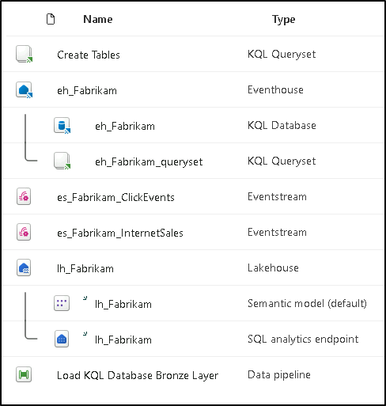

2.  Click on the **+ New** **Item** button to create a new item.

    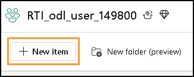  

3.  You will see a category for **Visualize Data**. Click on the item called **Real-Time Dashboard**.

    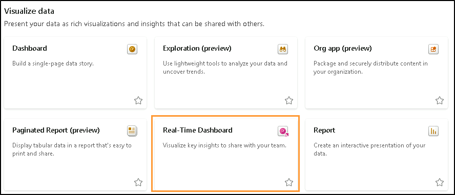

4.  Give your Real-Time Dashboard the name **RTI Dashboard** and then click on **Create**.

    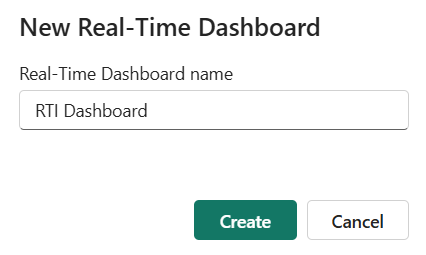

5.  You should be immediately taken to a blank instance of a Real-Time Dashboard.

    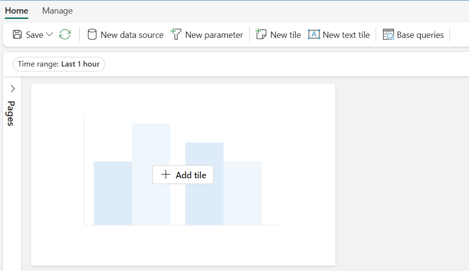

## Task 2: Connect a Data Source to Real-Time Dashboard

1.  Under the Home ribbon find the option called **New data source** and click it.

    
    
2.  In the flyout pane that appears on the right-hand side of the screen, click on **Add +** and then choose **OneLake data hub**.

     
    
4.  A list of available sources in your OneLake will appear, only sources from KQL Databases will be listed so one option will be
    available for you, the **eh_Fabrikam** KQL Database. Select that option.

    
    
4.  At the bottom of the screen click **Connect**.

    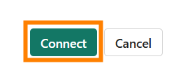

5.  You will now be able to create the data source. Click on the **Add** button at the bottom of the flyout pane.

    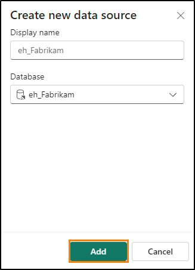

6.  You will now see that one data source has been added to the Real-Time Dashboard. From here you could add additional KQL
    Databases should the need arise. For now, click on **Close** at the bottom of the window.

    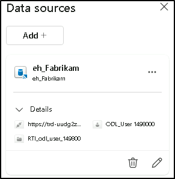

## Task 3: Create a Real-Time Dashboard Tile with KQL

1.  Click on the blank tile within the dashboard to populate the tile with a visual.

    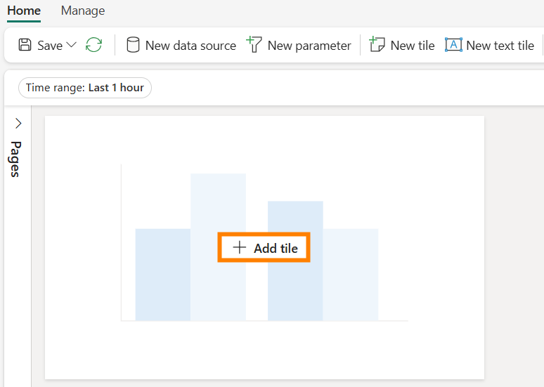

2.  By default you will connect to the KQL Database you created earlier as your source. From here you can write out your own KQL query to
    populate this visual with data. Delete all previous markdown KQL that is there by default. Copy and paste the following query into
    the query window.

   

3.  Run the query once you have it configured correctly to see the results.

    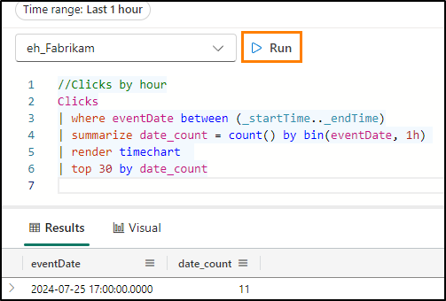

4.  Notice that you may only have one result in your output. This is because of the **Time range** that is set by default for this tile.
    You have a parameter with which you can alter the range of time with which you are returning data from. The eventDate between (\_startTime..\_endTime) is what allows you to take advantage of this parameter. Modify the **Time Range** parameter to **Last 3 hours** and observe how your output changes.

    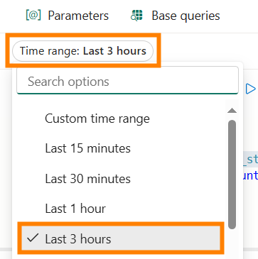

5.  You should now see in your query output the results of clicks over the last 3 hour window.

    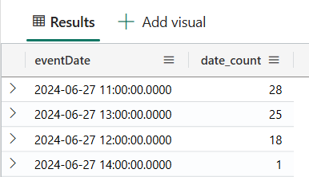

6.  While this parameter can be modified, you may wish for it to default to a specific time range instead of forcing users to modify it.
    Above the time range option, click on the **@ Parameters** option.

    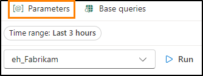

7.  Click the **pencil icon** to edit the **Time range** parameter.

    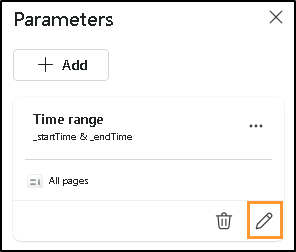

8.  Change the **Default value** to **Last 24 hours** to always show the last day by default. Click **Done** when finished.

    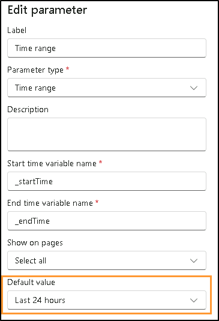

9.  Close the parameter pane.

10. Now click on the **+ Add visual button** above the query results.

    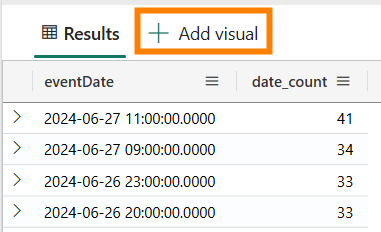

11. A new flyout will appear on the right-hand side of the screen. Click in the text box underneath the **Tile name** option to give this
    visual the name **Clicks by Hour**.

    

12. By default, the visual that you're using to display the results of this KQL query is a table. This may not be the best way for someoneto quickly consume and comprehend what is happening with the results of your data. Change the type of visual from a table to an **Area chart**.

    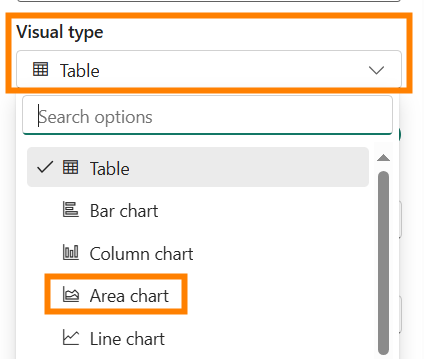

13. With this newly formatted visual, you can better understand the peaks and valleys of Clicks from your e-commerce site using the data stream you created earlier in this class.

    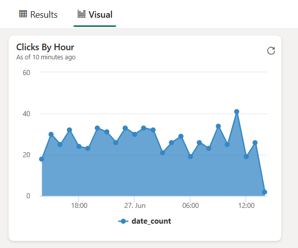

14. To save this visual down to the Dashboard, click on the **Apply changes** button in the top-right corner of the screen.

    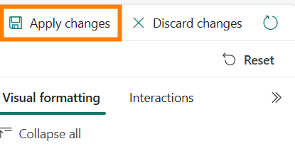

15. Once this visual has been placed within the Dashboard, notice again that the visual is only showing the last hour of results. Modify the Dashboard to show the **Time Range** of the **Last 24 hours**.

    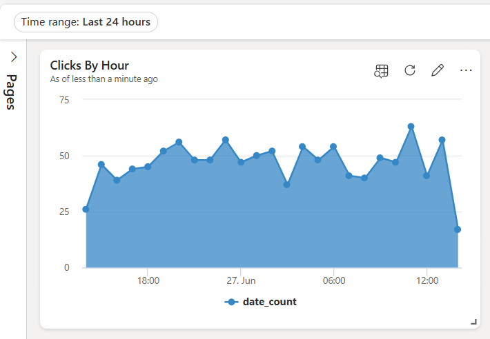

16. Refresh the visual and notice that the results will slightly change to reflect the data that has come in since the last execution of the query.

    

## Task 4: Add More Dashboard Tiles to Real-Time Dashboard

1.  From the **Home ribbon** in the Real-Time Dashboard click on the **New tile** button.

    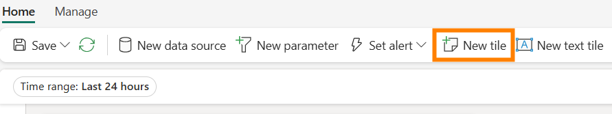

2.  Enter the following KQL query into the query pane.

     

3.  **Run** the query.

    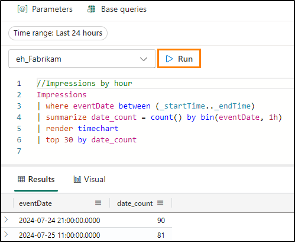

4.  Click the **+ Add** visual button.

    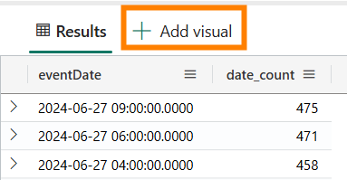

5.  Edit the visual to change the **Tile name** to **Impressions by Hour** and the **Visual Type** to **Area chart**.

    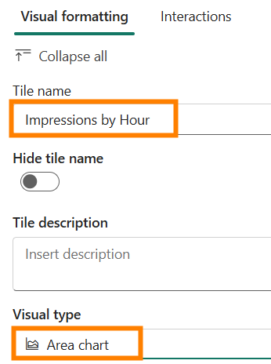

6.  Apply changes to the visual.

    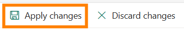

7.  Add another **+ New tile**.

    

8.  Copy and paste the following query into the query pane. Note, this is a multi-statement query that uses multiple let statements & a
    query combined by semicolons.

     

9.  **Run** the query to view the results.

    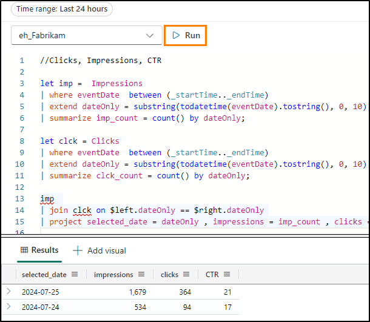

10. Click the **+ Add visual** button.

11. When the visual settings appear modify the following settings to
    create a count of Impressions.

-   **Tile name** - Impressions

-   **Visual type** - Stat

-   **Value column** - impressions (long)

    

12. Choose **Apply changes** when all settings are configured appropriately.

    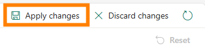

13. On the new tile, click on the ellipses (...) and select the option to **Duplicate tile**.

    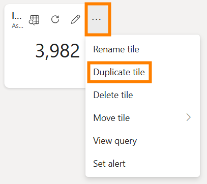

14. Click on the **pencil icon** for the duplicated tile to edit the configurations.

    

15. Rename this **Tile name** to **Clicks** and change the **Value column** to **clicks (long)**.

    

16. Apply the changes to this visual.

17. Duplicate either one of the new tiles one more time to create one final stat visual.

    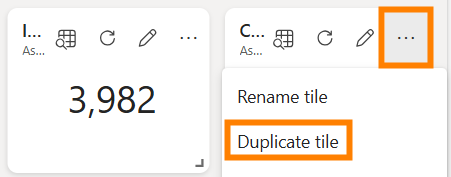

18. Edit the new tile to change the **Tile name** to **Click Through Rate** and the **Value column** to **CTR (long)**.

    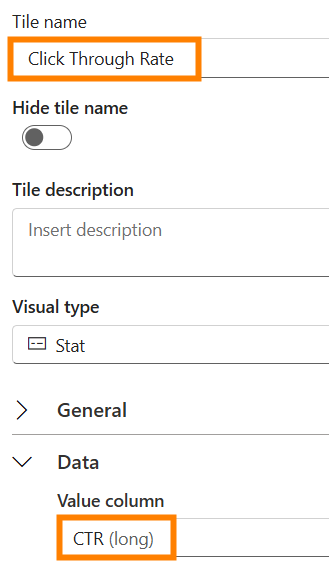

19. Apply the changes.

20. If the tiles are separated or you wish to reorganize them, you can hover over the tile until a hand icon appears and drag and drop the
    visual where you wish.

    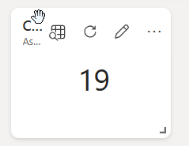

## Task 5: Add Map Visual for Impressions by Location

1.  Add a **New tile** to the Real-Time Dashboard.

    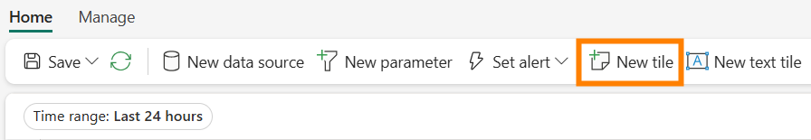

2.  Copy and paste the following query into the query pane. This query extracts the latitude and longitude from the Ip address column from
    this data stream to generate a location that you can plot on a map.This query can take a little bit more time than the previous ones.

   

3.  Execute the query to validate that it is configured correctly. Click
    the **+ Add visual** button.

    

4.  Change the **Tile name** to **Impressions by Location** and the **Visual type** to **Map**.

    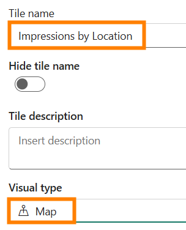

5.  Under the **Visual type** area ensure that the latitude and longitude are selected appropriately by modifying the **Define location by** option to **Latitude and Longitude** and verify that the remaining fields match the image below.

    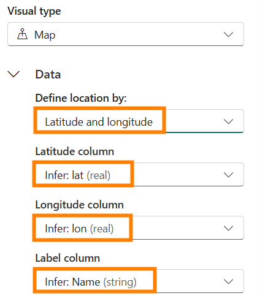

6.  Apply the changes.

7.  Grab the anchor point on the bottom left of the map visual within the Dashboard to increase the size of the visual.

    

8.  All the visuals are resizable and movable. Feel free to rearrange yours how you wish.

    

9.  Save your changes.

    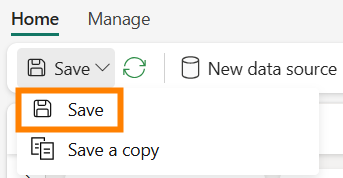

## Task 6: Setup Auto Refresh on the Real-Time Dashboard

1.  Click on the **Manage ribbon** and then select the option **Auto Refresh**.

    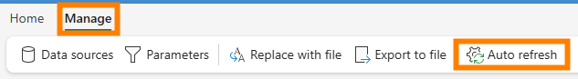

2.  Turn on the toggle to enable **Auto Refresh**.

    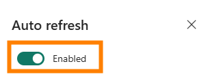

3.  Modify the **Minimum time interval** to 30 seconds and the **Default refresh rate** to 1 minute.

    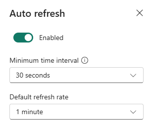

4.  Click **Apply** at the bottom of the window.

5.  In the top-right corner of your menu, click on the **Editing button** and modify it to **Viewing** to see what your end users
    will experience with this Real-Time Dashboard.

    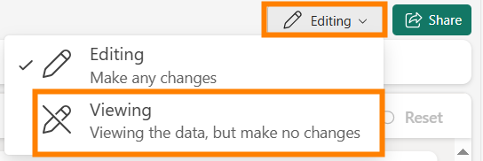

6.  If time allows and you are interested in retrieving a company logo or applying conditional formatting to your visuals as shown below,feel free to work through the optional tasks below. Otherwise, the lab is complete!

    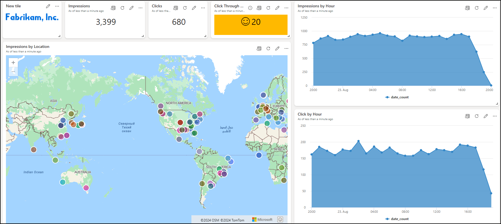

## Optional Task 7: Add Company Logo

1.  Just as we did before switch from the **Viewing** mode of the dashboard to the **Editing** mode
    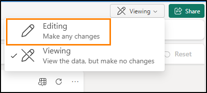

2.  Click on the button in the Home ribbon called **New text tile**.

    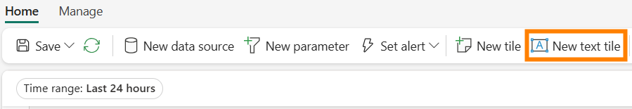

3.  Copy and paste the following markdown code within the query window.

    

    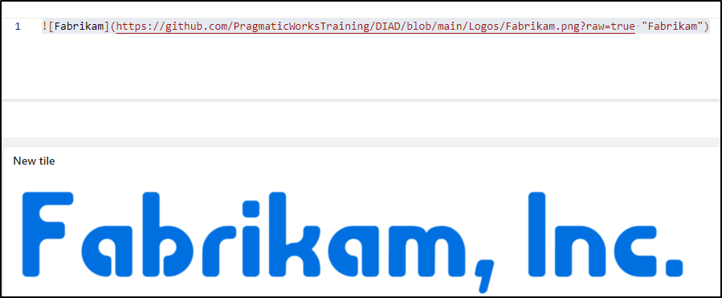

4 . Apply the changes.

5. Resize and move the tile to fit somewhere within your Real-Time
Dashboard. 

6. Save your changes.

    

## Optional Task 8: Apply Conditional Formatting to Visual

1.  Click on the **pencil icon** on the **Click Through Rate** visual.

    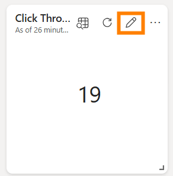

2.  At the bottom of the visual formatting pane, click on the **+ Add rule** button underneath **Conditional formatting**.

    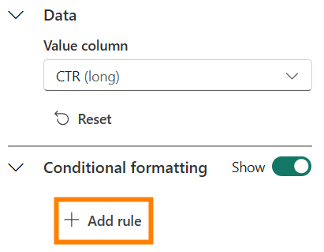

3.  Click the **pencil icon** to edit the conditional formatting rule.

    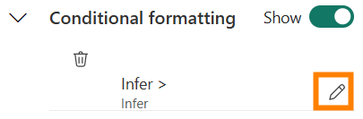

4.  Modify the conditions of the rule to point to the **Column** called **CTR (long)** and make the rule **\> 10** for the operator and value.

    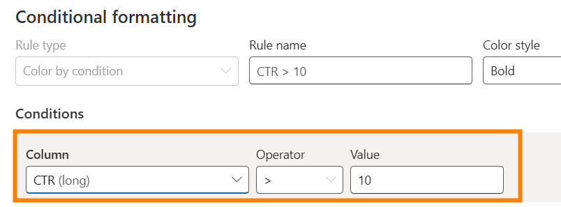

5.  Feel free to modify the Formatting however you wish. As long as the value of the CTR is greater than 10 it will appear on that visual.

    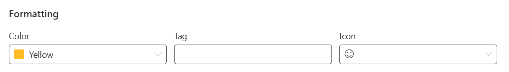

6.  Click the **Save** button within the Conditional formatting pane.

    

7.  Apply the changes.

8.  Save your changes.

    

# Summary

In this lab, users created a Real-Time Dashboard and connected it to our KQL Database. We got to see that we use the KQL language to curate
queries and then we can visualize the results in many ways, with each visual having its own configuration. As well we saw how we could
modify the default parameter available in the dashboard and make it so the dashboard will automatically refresh.

# References 

Fabric Real-Time Intelligence in a Day (RTIIAD) introduces you to some of the key functions available in Microsoft Fabric. In the menu of the
service, the Help (?) section has links to some great resources.

Here are a few more resources that will help you with your next steps with Microsoft Fabric.

-   See blog post to read the full [[Microsoft Fabric GA][announcement](https://aka.ms/Fabric-Hero-Blog-Ignite23)
-   Explore Fabric through the [[Guided Tour]](https://aka.ms/Fabric-GuidedTour)
-   Sign up for the [[Microsoft Fabric free trial]](https://aka.ms/try-fabric)
-   Visit the [[Microsoft Fabric website](https://aka.ms/microsoft-fabric)
-   Learn new skills by exploring the [[Fabric Learning modules]](https://aka.ms/learn-fabric)
-   Explore the [[Fabric technical documentation]](https://aka.ms/fabric-docs)
-   Read the [[free e-book on getting started with fabric]](https://aka.ms/fabric-get-started-ebook)
-   Join the [[Fabric community]](https://aka.ms/fabric-community) to post  your questions, share your feedback, and learn from others

Read the more in-depth Fabric experience announcement blogs:

-   [[Data Factory experience in Fabric blog]](https://aka.ms/Fabric-Data-Factory-Blog)

-   [[Synapse Data Engineering experience in Fabric blog]](https://aka.ms/Fabric-DE-Blog)

-   [[Synapse Data Science experience in Fabric blog]](https://aka.ms/Fabric-DS-Blog)

-   [[Synapse Data Warehousing experience in Fabric blog]](https://aka.ms/Fabric-DW-Blog)

-   [[Real-](https://aka.ms/Fabric-RTA-Blog)[Time Intelligence experience in Fabric blog](https://blog.fabric.microsoft.com/en-us/blog/category/real-time-intelligence)]

-   [[Power BI announcement blog]](https://aka.ms/Fabric-PBI-Blog)

-   [[Data Activator experience in Fabric blog]](https://aka.ms/Fabric-DA-Blog)

-   [[Administration and governance in Fabric blog]](https://aka.ms/Fabric-Admin-Gov-Blog)

-   [[OneLake]{.underline} [in Fabric blog]](https://aka.ms/Fabric-OneLake-Blog)

-   [[Dataverse and Microsoft Fabric integration blog]{.underline}](https://aka.ms/Dataverse-Fabric-Blog)

© 2024 Microsoft Corporation. All rights reserved.

By using this demo/lab, you agree to the following terms:

The technology/functionality described in this demo/lab is provided by Microsoft Corporation for purposes of obtaining your feedback and to
provide you with a learning experience. You may only use the demo/lab to evaluate such technology features and functionality and provide

feedback to Microsoft. You may not use it for any other purpose. You may not modify, copy, distribute, transmit, display, perform, reproduce, publish, license, create derivative works from, transfer, or sell this demo/lab or any portion thereof.

COPYING OR REPRODUCTION OF THE DEMO/LAB (OR ANY PORTION OF IT) TO ANY OTHER SERVER OR LOCATION FOR FURTHER REPRODUCTION OR REDISTRIBUTION IS
EXPRESSLY PROHIBITED. THIS DEMO/LAB PROVIDES CERTAIN SOFTWARE TECHNOLOGY/PRODUCT FEATURES
AND FUNCTIONALITY, INCLUDING POTENTIAL NEW FEATURES AND CONCEPTS, IN A SIMULATED ENVIRONMENT WITHOUT COMPLEX SET-UP OR INSTALLATION FOR THE PURPOSE DESCRIBED ABOVE. THE TECHNOLOGY/CONCEPTS REPRESENTED IN THIS DEMO/LAB MAY NOT REPRESENT FULL FEATURE FUNCTIONALITY AND MAY NOT WORK THE WAY A FINAL VERSION MAY WORK. WE ALSO MAY NOT RELEASE A FINAL VERSION OF SUCH FEATURES OR CONCEPTS. YOUR EXPERIENCE WITH USING SUCH FEATURES AND FUNCITONALITY IN A PHYSICAL ENVIRONMENT MAY ALSO BE DIFFERENT.

**FEEDBACK**. If you give feedback about the technology features, functionality and/or concepts described in this demo/lab to Microsoft,
you give to Microsoft, without charge, the right to use, share and commercialize your feedback in any way and for any purpose. You also give to third parties, without charge, any patent rights needed for their products, technologies and services to use or interface with any
specific parts of a Microsoft software or service that includes the feedback. You will not give feedback that is subject to a license that
requires Microsoft to license its software or documentation to third parties because we include your feedback in them. These rights survive
this agreement.

MICROSOFT CORPORATION HEREBY DISCLAIMS ALL WARRANTIES AND CONDITIONS WITH REGARD TO THE DEMO/LAB, INCLUDING ALL WARRANTIES AND CONDITIONS OF
MERCHANTABILITY, WHETHER EXPRESS, IMPLIED OR STATUTORY, FITNESS FOR A PARTICULAR PURPOSE, TITLE AND NON-INFRINGEMENT. MICROSOFT DOES NOT MAKE ANY ASSURANCES OR REPRESENTATIONS WITH REGARD TO THE ACCURACY OF THE RESULTS, OUTPUT THAT DERIVES FROM USE OF DEMO/ LAB, OR SUITABILITY OF THE INFORMATION CONTAINED IN THE DEMO/LAB FOR ANY PURPOSE.

**DISCLAIMER** 
This demo/lab contains only a portion of new features and enhancements in Microsoft Power BI. Some of the features might change in future releases of the product. In this demo/lab, you will learn about some, but not all, new features.
