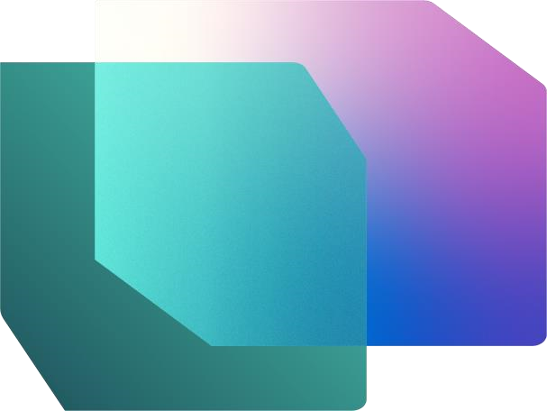

Contents

[Document Structure
[2](#_Toc168496498)](file:///C:\Users\Shivashant\Downloads\RTIAD%20Templates\RTIAD\RTIAD\Lab%201.docx#_Toc168496498)

[Scenario / Problem Statement
[3](#_Toc168496499)](file:///C:\Users\Shivashant\Downloads\RTIAD%20Templates\RTIAD\RTIAD\Lab%201.docx#_Toc168496499)

[Introduction
[3](#_Toc168496500)](file:///C:\Users\Shivashant\Downloads\RTIAD%20Templates\RTIAD\RTIAD\Lab%201.docx#_Toc168496500)

[Fabric License
[4](#_Toc168496501)](file:///C:\Users\Shivashant\Downloads\RTIAD%20Templates\RTIAD\RTIAD\Lab%201.docx#_Toc168496501)

[Task 1: Enable a Microsoft Fabric trial license
[4](#_Toc168496502)](file:///C:\Users\Shivashant\Downloads\RTIAD%20Templates\RTIAD\RTIAD\Lab%201.docx#_Toc168496502)

[Real-Time Intelligence and Real-Time Hub
[7](#_Toc168496503)](file:///C:\Users\Shivashant\Downloads\RTIAD%20Templates\RTIAD\RTIAD\Lab%201.docx#_Toc168496503)

[Task 2: Real-Time Intelligence Experience Items
[7](#_Toc168496504)](file:///C:\Users\Shivashant\Downloads\RTIAD%20Templates\RTIAD\RTIAD\Lab%201.docx#_Toc168496504)

[Task 3: Real-Time Hub
[8](#_Toc168496505)](file:///C:\Users\Shivashant\Downloads\RTIAD%20Templates\RTIAD\RTIAD\Lab%201.docx#_Toc168496505)

[Create Workspace and Eventhouse
[9](#_Toc168496506)](file:///C:\Users\Shivashant\Downloads\RTIAD%20Templates\RTIAD\RTIAD\Lab%201.docx#_Toc168496506)

[Task 4: Create a Fabric Workspace
[9](#_Toc168496507)](file:///C:\Users\Shivashant\Downloads\RTIAD%20Templates\RTIAD\RTIAD\Lab%201.docx#_Toc168496507)

[Task 5: Create an Eventhouse
[11](#_Toc168496508)](file:///C:\Users\Shivashant\Downloads\RTIAD%20Templates\RTIAD\RTIAD\Lab%201.docx#_Toc168496508)

[References
[15](#_Toc168496509)](file:///C:\Users\Shivashant\Downloads\RTIAD%20Templates\RTIAD\RTIAD\Lab%201.docx#_Toc168496509)

[]{#_Toc168496498 .anchor}**Document Structure**

The lab includes steps for the user to follow along with associated
screenshots that provide visual aid. In each screenshot, sections are
highlighted with orange boxes to indicate the area(s) user should focus
on.

[]{#_Toc168496499 .anchor}**Scenario / Problem Statement**

Fabrikam is an e-commerce company specializing in a wide range of
outdoor equipment and accessories. The company caters to retail
customers globally through its online platform and is planning to
enhance its presence in new international markets. There is a new
initiative that involves providing real-time insights from an e-commerce
site to provide executives with the ability to make timely decisions
based on current information.

As an Analytics Engineer on the Sales team, your responsibilities
include collecting, cleaning, and interpreting data sets to solve
business problems. You create and maintain batch data pipelines, develop
visualizations like charts and graphs, build and optimize comprehensive
semantic models and reports, and present your findings to
decision-makers in the organization.

**Current Challenges**

-   You need to handle a continuous stream of real-time data from the
    e-commerce website, which requires a robust and scalable
    architecture.

-   Ensuring real-time data processing and analytics to keep up with the
    fast-paced nature of online sales.

-   Handling the volume and velocity of data generated by user
    interactions, transactions, and website activity.

-   Integrating real-time streaming data with historical data for
    comprehensive analysis.

-   Using the Medallion architecture in an Eventhouse environment to
    structure the data flow efficiently.

-   Leveraging the Eventhouse Data within a Lakehouse

-   You\'re interested in leveraging Microsoft Fabric to address the
    above challenges, using Eventhouse, KQL Database, and Eventstream to
    build a resilient and efficient data processing pipeline.

[]{#_Toc168496500 .anchor}**Introduction**

Today you will learn about various key features of Microsoft Fabric.
This is an introductory workshop intended to introduce you to the
various product experiences and items available in Fabric. By the end of
this workshop, you will learn how to use an Eventhouse, Data Pipeline,
Eventstream, KQL Queryset and a Real-Time Dashboard.

By the end of this lab, you will have learned:

-   Explore Fabric Personas

-   How to create a Fabric workspace

-   How to create an Eventhouse

[]{#_Toc168496501 .anchor}**Fabric License**

[]{#_Toc168496502 .anchor}Task 1: Enable a Microsoft Fabric trial
license

1.  Open the **Microsoft Edge** **browser** on the desktop and navigate
    to [https://app.powerbi.com/.](https://app.powerbi.com/) You will be
    navigated to the login page. **Note:** If you are not using the lab
    environment and have an existing Power BI account, you may want to
    use the browser in private / incognito mode.

2.  Enter the **Username** available in the **Environment Variables**
    tab (next to the Lab Guide) as the **Email** and click **Submit.**

3.  You will be navigated to the **Password** screen. Enter the
    **Password** available in the **Environment Variables** tab (next to
    the Lab Guide) shared with you by the instructor.

4.  Click **Sign in** and follow the prompts to sign into Fabric.

5.  You will be navigated to the familiar **Power BI Service Home
    page**.

6.  We assume you are familiar with the layout of Power BI Service. If
    you have any questions, please do not hesitate to ask the
    instructor.

Currently, you are in **My Workspace**. To work with Fabric items, you
will need a trial license and a workspace that has Fabric license. Let's
set this up.

7.  On the top right corner of the screen, select the **user** **icon**.

8.  Select **Start trial**.

9.  Upgrade to a free Microsoft Fabric trial dialog opens. Select
    **Start trial**.

10. Select the "**X**" on the top right corner of **Just one last step**
    dialog to close the dialog. We will not be providing these details
    as this is a lab environment.

11. Successfully upgraded to Microsoft Fabric dialog opens. Select
    **Fabric Home Page**.

12. You will be navigated to the **Microsoft** **Fabric Home page**.

[]{#_Toc168496503 .anchor}**Real-Time Intelligence and Real-Time Hub**

[]{#_Toc168496504 .anchor}Task 2: Real-Time Intelligence Experience
Items

1.  Click on the Real-Time Intelligence Experience.

2.  You will be navigated to **Real-Time Intelligence Home page**. You
    will see **New**, **Recommended**, and **Quick Access** categories.
    With the **New** category notice the items:

    a.  **Eventhouse:** Used to create a workspace of one or multiple
        KQL database(s), which can be shared across projects. Also
        creates a KQL Database within the Eventhouse.

    b.  **KQL** **Queryset:** Used to run queries on the data to produce
        shareable tables and visuals.

    c.  **Real-Time Dashboard**: A collection of tiles, optionally
        organized in pages, where each tile has an underlying query and
        a visual representation.

    d.  **Eventstream:** Used to capture, transform, and route real-time
        event stream.

    e.  **Reflex:** For automatically taking actions when patterns or
        conditions are detected in changing data.

    f.  **Use a sample:** Sample solution.

[]{#_Toc168496505 .anchor}Task 3: Real-Time Hub

1.  Click on the **Real-Time hub** within the Fabric navigation pane on
    the left side of the screen.

2.  The Real-Time hub is the single place for streaming data-in-motion
    across your entire organization. Every Microsoft Fabric tenant is
    automatically provisioned with the hub. It enables you to easily
    discover, ingest, manage, and consume data-in-motion from a wide
    variety of sources.

3.  Within the Real-Time hub you have access to three different types of
    data integration.

-   **Data streams**: For your running eventstreams and KQL databases,
    all the stream outputs from eventstreams and tables from KQL
    databases automatically show up in Real-Time hub.

-   **Microsoft sources**: Lists all streaming resources from Microsoft
    services. Whether it's Azure Event Hubs, Azure IoT Hub, or other
    services, you can seamlessly ingest data into Real-Time hub.

-   **Fabric events:** Events that are generated via Fabric artifacts
    and external sources, are made available in Fabric to support
    event-driven scenarios like real-time alerting and triggering
    downstream actions. You can monitor and react to events including
    Fabric workspace item events and Azure Blob Storage events.

4.  In the top-right corner of the Real-Time hub, click on the **+ Get
    events** button.

5.  A window will appear and will detail the currently available streams
    of data that are available to integrate into the Real-Time hub. This
    includes a mixture of Azure sources as well as external cloud
    streaming sources like Amazon Kinesis, Confluent Cloud Kafka, and
    Google Cloud Pub/Sub.

6.  **Close** the Get events window by clicking the "X" in the upper
    right corner.

[]{#_Toc168496506 .anchor}**Create Workspace and Eventhouse**

[]{#_Toc168496507 .anchor}Task 4: Create a Fabric Workspace

1.  Now let's create a workspace with Fabric license. Select
    **Workspaces** from the left navigation bar. A dialog opens.

2.  Select **New workspace**.

3.  **Create a workspace** dialog opens on the right side of the
    browser.

4.  In the **Name** field enter **RTI_username**. Use the username
    provided to you from the environment details.

**Note:** The workspace name must be unique. Make sure a green check
mark with "**This name is available**" is displayed below the Name
field.

5.  If you choose, you can enter a **Description** for the workspace.
    This is an optional field.

6.  Click on **Advanced** to expand the section.

7.  Under **License mode**, make sure **Trial** is selected. (It should
    be selected by default.)

8.  Select **Apply** to create a new workspace.

[]{#_Toc168496508 .anchor}Task 5: Create an Eventhouse

1.  Click the **+ New** box to find all the items you can create in this
    Fabric workspace.

2.  Select the **Eventhouse** option from the drop-down list. As we have
    talked about this can be looked at similarly to a Lakehouse in that
    we can store data but focused around real time data.

3.  In the window that appears, give your Eventhouse the name,
    **eh_Fabrikam** and click on **Create**.

4.  This is where you will ultimately stream data from various sources
    through the rest of the training today. When the item is created, a
    window will appear giving you some details about the Eventhouse.
    Click on the **Get started** button.

5.  Take a quick tour of the Eventhouse by following the green tooltips
    on your screen. This first one shows that an empty Kusto Query
    Language (KQL) Database was created with the Eventhouse.

6.  Follow the remainder of the tooltips around the screen to show you
    where to create additional databases, check the storage in OneLake
    of the Eventhouse, check the usage of Fabric resources in compute
    minutes, and finally see what actions have occurred in the
    Eventhouse.

7.  Within the navigational pane of the Eventhouse, find your KQL
    Database that was created alongside the Eventhouse. Click on the
    ellipses (...) and then select the option **Open in new tab**.

8.  This will allow us to still have one tab in our browser to see the
    overview of our entire Eventhouse and a new tab to focus on the KQL
    Database properties. One goal that we wish to accomplish in our
    scenario is ensuring that the data streamed to the KQL database is
    accessible via OneLake. By enabling this feature, we make the data
    in this KQL Database easily discoverable through shortcuts to be
    used in any Lakehouse we may want. Click on the pencil icon next to
    the **OneLake availability** property.

9.  Enable this property by toggling the switch to **Active** and then
    click on **Done** at the bottom of the window.

10. Return to your **RTI_username** workspace.

11. If you see the **Task Flows** option, grab the anchor point in the
    middle of the screen and slide the menu up to the top of your screen
    to hide. 

12. You now have the basis for how you will begin to ingest the
    streaming data into your OneLake. The next step is to create a
    stream of data that can receive the data in motion.

In this lab, we explored the Real-Time Intelligence interface, examined
the Real-Time hub, created a Fabric workspace, and an Eventhouse that
came with a KQL Database. In the next lab, you will begin to explore
techniques that ingest data from various sources across your data estate
to OneLake and do some basic analysis with the Kusto Query Language
(KQL).

[]{#_Toc168496509 .anchor}**References**

Fabric Real-time Intelligence in a Day (RTIIAD) introduces you to some
of the key functions available in Microsoft Fabric.

In the menu of the service, the Help (?) section has links to some great
resources.

Here are a few more resources that will help you with your next steps
with Microsoft Fabric.

-   See blog post to read the full [Microsoft Fabric GA
    announcement](https://aka.ms/Fabric-Hero-Blog-Ignite23)

-   Explore Fabric through the [Guided
    Tour](https://aka.ms/Fabric-GuidedTour)

-   Sign up for the [Microsoft Fabric free
    trial](https://aka.ms/try-fabric)

-   Visit the [Microsoft Fabric
    website](https://aka.ms/microsoft-fabric)

-   Learn new skills by exploring the [Fabric Learning
    modules](https://aka.ms/learn-fabric)

-   Explore the [Fabric technical
    documentation](https://aka.ms/fabric-docs)

-   Read the [free e-book on getting started with
    Fabric](https://aka.ms/fabric-get-started-ebook)

-   Join the [Fabric community](https://aka.ms/fabric-community) to post
    your questions, share your feedback, and learn from others

Read the more in-depth Fabric experience announcement blogs:

-   [Data Factory experience in Fabric
    blog](https://aka.ms/Fabric-Data-Factory-Blog)

-   [Synapse Data Engineering experience in Fabric
    blog](https://aka.ms/Fabric-DE-Blog)

-   [Synapse Data Science experience in Fabric
    blog](https://aka.ms/Fabric-DS-Blog)

-   [Synapse Data Warehousing experience in Fabric
    blog](https://aka.ms/Fabric-DW-Blog)

-   [Real-](https://aka.ms/Fabric-RTA-Blog)[Time Intelligence experience
    in Fabric
    blog](https://blog.fabric.microsoft.com/en-us/blog/category/real-time-intelligence)

-   [Power BI announcement blog](https://aka.ms/Fabric-PBI-Blog)

-   [Data Activator experience in Fabric
    blog](https://aka.ms/Fabric-DA-Blog)

-   [Administration and governance in Fabric
    blog](https://aka.ms/Fabric-Admin-Gov-Blog)

-   [OneLake in Fabric blog](https://aka.ms/Fabric-OneLake-Blog)

-   [Dataverse and Microsoft Fabric integration
    blog](https://aka.ms/Dataverse-Fabric-Blog)

© 2024 Microsoft Corporation. All rights reserved.

By using this demo/lab, you agree to the following terms:

The technology/functionality described in this demo/lab is provided by
Microsoft Corporation for purposes of obtaining your feedback and to
provide you with a learning experience. You may only use the demo/lab to
evaluate such technology features and functionality and provide feedback
to Microsoft. You may not use it for any other purpose. You may not
modify, copy, distribute, transmit, display, perform, reproduce,
publish, license, create derivative works from, transfer, or sell this
demo/lab or any portion thereof.

COPYING OR REPRODUCTION OF THE DEMO/LAB (OR ANY PORTION OF IT) TO ANY
OTHER SERVER OR LOCATION FOR FURTHER REPRODUCTION OR REDISTRIBUTION IS
EXPRESSLY PROHIBITED.

THIS DEMO/LAB PROVIDES CERTAIN SOFTWARE TECHNOLOGY/PRODUCT FEATURES AND

FUNCTIONALITY, INCLUDING POTENTIAL NEW FEATURES AND CONCEPTS, IN A
SIMULATED

ENVIRONMENT WITHOUT COMPLEX SET-UP OR INSTALLATION FOR THE PURPOSE
DESCRIBED

ABOVE. THE TECHNOLOGY/CONCEPTS REPRESENTED IN THIS DEMO/LAB MAY NOT
REPRESENT FULL

FEATURE FUNCTIONALITY AND MAY NOT WORK THE WAY A FINAL VERSION MAY WORK.
WE ALSO

MAY NOT RELEASE A FINAL VERSION OF SUCH FEATURES OR CONCEPTS. YOUR
EXPERIENCE WITH USING SUCH FEATURES AND FUNCITONALITY IN A PHYSICAL
ENVIRONMENT MAY ALSO BE DIFFERENT.

**FEEDBACK**. If you give feedback about the technology features,
functionality and/or concepts described in this demo/lab to Microsoft,
you give to Microsoft, without charge, the right to use, share and
commercialize your feedback in any way and for any purpose. You also
give to third parties, without charge, any patent rights needed for
their products, technologies and services to use or interface with any
specific parts of a Microsoft software or service that includes the
feedback. You will not give feedback that is subject to a license that
requires Microsoft to license its software or documentation to third
parties because we include your feedback in them. These rights survive
this agreement.

MICROSOFT CORPORATION HEREBY DISCLAIMS ALL WARRANTIES AND CONDITIONS
WITH REGARD

TO THE DEMO/LAB, INCLUDING ALL WARRANTIES AND CONDITIONS OF
MERCHANTABILITY,

WHETHER EXPRESS, IMPLIED OR STATUTORY, FITNESS FOR A PARTICULAR PURPOSE,
TITLE AND NON-

INFRINGEMENT. MICROSOFT DOES NOT MAKE ANY ASSURANCES OR REPRESENTATIONS
WITH REGARD TO THE ACCURACY OF THE RESULTS, OUTPUT THAT DERIVES FROM USE
OF DEMO/ LAB, OR SUITABILITY OF THE INFORMATION CONTAINED IN THE
DEMO/LAB FOR ANY PURPOSE.

**DISCLAIMER**

This demo/lab contains only a portion of new features and enhancements
in Microsoft Power BI. Some of the features might change in future
releases of the product. In this demo/lab, you will learn about some,
but not all, new features.

{width="3.039861111111111in"
height="2.2829166666666665in"}{width="3.8958333333333335in"
height="1.2986111111111112in"}{width="3.039861111111111in"
height="2.2829166666666665in"}

> Contents

[Document Structure [3](#document-structure)](#document-structure)

[Scenario / Problem Statement [3](#_Toc169167734)](#_Toc169167734)

[Introduction [3](#introduction)](#introduction)

[Fabric Eventstreams [4](#fabric-real-time-hub)](#fabric-real-time-hub)

[Task 1: Create an Eventstream
[4](#task-1-create-an-event-stream-source)](#task-1-create-an-event-stream-source)

[Task 2: Setup Eventstream Source [5](#_Toc169167738)](#_Toc169167738)

[Task 3: Setup Eventstream Destination
[10](#task-2-setup-eventstream-destination)](#task-2-setup-eventstream-destination)

[Kusto Query Language (KQL)
[13](#kusto-query-language-kql)](#kusto-query-language-kql)

[Task 4: Authoring Kusto Database Queries
[13](#task-3-authoring-kusto-database-queries)](#task-3-authoring-kusto-database-queries)

[Task 5: Using T-SQL Queries Against a KQL Database
[19](#task-4-using-t-sql-queries-against-a-kql-database)](#task-4-using-t-sql-queries-against-a-kql-database)

[KQL Queryset [21](#kql-queryset)](#kql-queryset)

[Task 6: Create a KQL Queryset
[21](#task-5-create-a-kql-queryset)](#task-5-create-a-kql-queryset)

[References [23](#references)](#references)

# Document Structure 

> The lab includes steps for the user to follow along with associated
> screenshots that provide visual aid. In each screenshot, sections are
> highlighted with orange boxes to indicate the area(s) user should
> focus on.

# Introduction 

> In this lab, you will experience a way to handle a continuous stream
> of real-time data. You will use a Fabric Real-Time Intelligence object
> called an Eventstream to ingest this data to the Eventhouse you
> created in the last lab and write some basic KQL queries.
>
> By the end of this lab, you will have learned:

-   How to create an Eventstream

-   Load Real-time data into a KQL Database

-   Write basic Kusto Query Language Queries

#  Fabric Real-Time Hub

## Task 1: Create an Event Stream Source 

1.  Open the **Fabric workspace** you created in the last lab. From here
    we can see the Eventhouse we created.

{width="2.886068460192476in"
height="1.9866907261592301in"}

2.  Navigate to the "Real-Time hub" where currently we do not see any
    streams of data. That will change shortly.

{width="2.3068810148731407in"
height="2.1558661417322833in"}

3.  Select the "Get events" green button which should be in the upper
    right corner.

{width="2.917073490813648in"
height="2.0523698600174978in"}

4.  A window will open that will allow you to select a source for our
    stream data. As we discussed before, there are many fantastic
    options to choose from but for this class we will select the option
    "Azure Event Hubs".\
    \
    {width="6.506944444444445in"
    height="2.954861111111111in"}

5.  You are now required to create a connection to the Azure Event Hub.
    Click on the **New connection** text since you do not currently have
    a connection.\
    \
    {width="3.4948501749781276in"
    height="2.2687160979877516in"}

6.  From your environment details page, copy and paste all the necessary
    connection settings into the appropriate fields. For these labs we
    are connecting to an Event Hub which has streaming data being sent
    from a python notebook. This notebook is creating fake sales
    transactions at rate of around 3,100 transactions per hour.\
    \
    Event Hub namespace: **realtimeconsumersiad**\
    \
    Event Hub: **rti-iad**\
    \
    Shared Access Key Name: **rti-reader\
    \
    **Shared Access Key:
    **H/5gTWuI+lQLT9HYBzuqzPdKaR6YWXCRw+AEhE6k1gE=**

7.  Once all properties have been filled out click on **Connect**.\
    \
    {width="5.563276465441819in"
    height="4.531882108486439in"}

8.  In the configuration of the Azure Event Hub data source, you will
    need to modify the **Consumer group** of the Event Hub to ensure
    that you gain access to a unique access point to the stream of data.
    Within your **Environment details** find the property that lists
    what your consumer group name will be and place that into the field
    box. It will appear something like "**cg-xx**".\
    \
    {width="5.594336176727909in"
    height="3.9375284339457566in"}

9.  Before we finalize this data source and Eventstream, let's go ahead
    and rename our Eventstream to something more useful. In the "Stream
    details\" section on the right select the pencil icon next to the
    "Eventstream name" and let's call our Eventstream
    "**es_Fabrikam_InternetSales".\
    **{width="2.3354965004374453in"
    height="2.1383048993875766in"}

10. Now we can click on **Next**, which will take us to a final overview
    page.\
    \
    {width="6.204362423447069in"
    height="3.6861986001749782in"}

11. In this overview screen, Verify the contents look correct and click
    **Create source**.\
    \
    {width="6.506944444444445in"
    height="3.8097222222222222in"}

12. Once the Eventstream and Eventstream source are created select the
    option "**Open Eventstream**"\
    \
    {width="3.055896762904637in"
    height="2.7150896762904635in"}

13. This will take you to the Eventstream user interface. Here is where
    you will see able to connect with a source stream of data, bring it
    into this Fabric item, and then stream it to a new destination like
    a Lakehouse or KQL Database.

14. It may take a few moments for your Source to be **Active** but after
    waiting a few moments, click on the middle icon with the name of
    your Eventstream on it and then click on **Refresh** if you do not
    see a preview of the data.\
    \
    **Note: If you receive a "Warning" status around and audit policy,
    that is fine. The stream will still function\
    **

{width="6.2590715223097115in"
height="1.971240157480315in"}

15. You should now see a sample of the data within the bottom window.\
    {width="4.631952099737533in"
    height="3.4554527559055117in"}

16. This will show you a preview of the data that is being received from
    the Azure Event Hub. If you slide your bottom horizontal scroll bar
    all the way to the right-side of your preview, you will be able to
    see the time that the data has been received in the Event Hub in two
    columns called, **EventProcessedUtcTime** and
    **EventEnqueuedUtcTime**. This should reflect the current date/time
    in UTC format.

{width="5.133778433945757in"
height="0.7667333770778653in"}

## Task 2: Setup Eventstream Destination

1.  Click on the tile within the canvas area labeled "Switch to edit
    mode to Transform event of add destination\
    \
    {width="4.834008092738408in"
    height="2.5628576115485564in"}

2.  Within the Eventstream user interface, click on the **Transform
    events or add destination** option to open the drop-down menu.

{width="2.486573709536308in"
height="1.9190988626421697in"}

3.  View the list of available operations that can be made to the
    stream.

{width="1.3973228346456692in"
height="2.0017814960629923in"}

4.  Look below the operations and you will find the **Destinations**
    select the option that says **KQL Database**.

{width="1.671599956255468in"
height="1.6412073490813648in"}

5.  A new menu will open on the right-hand side of the screen. The first
    thing you need to modify for the destination is the **data ingestion
    mode**. The two options are **Direct Ingestion** and **Event
    processing before ingestion.** Because we are not going to transform
    anything in our Eventstream and directly load this information in a
    KQL database table ensure that you have selected the **Direct
    ingestion** option.

{width="2.666897419072616in"
height="1.108429571303587in"}

6.  Modify the remainder of the settings with the following details
    below.

-   Destination name -- **eh-kql-db-Fabrikam**

-   Workspace -- **RTI_username**

-   KQL Database -- **eh_Fabrikam**

{width="2.327101924759405in"
height="3.5932141294838145in"}

7.  Click on Save.

8.  With the Eventstream configured, click on the **Publish** button to
    save this Eventstream and begin your ingestion.

{width="6.506944444444445in"
height="2.154861111111111in"}

9.  Choose the **Configure** option within the **Destination** to
    correctly map the stream to a table in the KQL Database.

{width="6.506944444444445in"
height="1.4020833333333333in"}

10. Click on the **+ New table** option underneath the the
    **eh_Fabrikam** database.

{width="5.957354549431321in"
height="3.353157261592301in"}

11. Give the new table the name, **InterentSales** and then click on the
    checkmark.

{width="3.3650524934383204in"
height="1.0001399825021873in"}

12. You may need to update your **"Data connection name"** to meet
    requirements. Let us rename it to
    **"eh_Fabrikam_es_InternetSales".** Then we can click on **Next.\
    \
    **{width="4.927771216097987in"
    height="3.604669728783902in"}**\
    **

13. After a few moments of searching for events, the user interface
    should allow you to see that sample data was found. Click on
    **Finish** at the bottom of the screen.

{width="5.978159448818897in"
height="3.678768591426072in"}

14. After this you will be shown a summary. Once you have all green
    checkmarks, click **close** to move forward.

15. Once you see the user interface showing the mappings from the source
    to the Eventstream to the destination, you have correctly configured
    and started a stream of data into your KQL Database.

{width="6.379064960629921in"
height="1.0130260279965004in"}

# Kusto Query Language (KQL)

## Task 3: Authoring Kusto Database Queries

1.  Make your way back to your **RTI_username** workspace. You should
    see two new objects that have been created because of your
    Eventstream. The Eventstream itself as well as a Real-Time
    Intelligence Data stream.

{width="5.573383639545057in"
height="2.2159241032370955in"}

2.  Open the **eh_Fabrikam** KQL Database item.

{width="4.057723097112861in"
height="1.2373326771653543in"}

3.  Within this experience, you can get an overview of the current
    structure, size, and use of the KQL Database. Because the
    Eventstream is sending data to this KQL Database consistently you
    will notice the amount of storage will increase over time.

{width="6.34346019247594in"
height="2.3749048556430448in"}

4.  Click on the **refresh icon** in the top-right corner of the screen.

{width="5.891737751531059in"
height="1.939808617672791in"}

5.  The size of the database should have grown. Your numbers here will
    not be exact in their reflection with screenshots in the remainder
    of the lab as depending on how long you take to complete the content
    you will have received less or more records than other members of
    the class. This is completely fine and will not affect your ability
    to follow along whatsoever.

{width="4.233502843394576in"
height="1.3045089676290464in"}

6.  Within your System details on the left-hand side of the screen,
    click on the table within your KQL Database called
    **InternetSales**.

{width="2.4261800087489065in"
height="2.2179932195975502in"}

7.  This menu will give you metadata details about the table you have
    created and any actively streaming data with your Eventstream.
    Again, the size of the table and the number of rows within the table
    are going to vary from student to student and will not affect your
    end results of this or any lab. A few additional items to call out
    on this menu include:

-   **Schema** -- This includes details about the column name and the
    data types of the column that can be queried with KQL.

-   **Mappings** -- This will list all the sources of data and in what
    format the data is being received. You can have various sources in
    various formats all mapping data to the same table on a KQL
    Database.

-   **OneLake availability** -- This is currently active because of the
    property we enabled at the higher level in the Eventhouse.

{width="5.439140419947506in"
height="4.204448818897638in"}

8.  Click on **Explore your data** in the top-right corner.

{width="6.213735783027122in"
height="1.9901192038495188in"}

9.  This will open an interface in which you can author KQL queries
    against your database tables. There are a few pre-scripted queries
    that are already authored but need some slight customization. There
    are also two links to Microsoft documentation that can be helpful
    when learning KQL or also looking at SQL to KQL conversions which
    will be discussed later throughout this class.

{width="5.557589676290464in"
height="2.634071522309711in"}

10. Click on **Line 8** and where the query says, **YOUR_TABLE_HERE**,
    replace that with the table name, **InternetSales**.

{width="6.506944444444445in"
height="0.6361111111111111in"}

11. Highlight **Line 8 and 9** and click on the **Run** button in the
    top-left corner of the window.

{width="3.037364391951006in"
height="2.1695450568678916in"}

12. The query uses the **take** operator to bring back a specified
    number of rows. When the query runs it will pull data from the
    InternetSales table and bring back whatever number of rows you have
    plugged into the query. For this example, 100 rows will return. The
    specific rows returned cannot be determined with this operator and
    the results of your query will vary from the result of others.

{width="5.39198053368329in"
height="2.6367180664916887in"}

13. Click on **Line 12** and where the query says, **YOUR_TABLE_HERE**,
    replace that with the table name, **InternetSales**.

{width="3.8963768591426073in"
height="0.6875962379702537in"}

14. Highlight **Line 12 and 13** and click on the **Run** button in the
    top-left corner of the window.\
    \
    {width="4.083903105861768in"
    height="1.6043908573928258in"}

15. This query uses the count operator. This query will return an
    aggregated number of records that exist at the time of the query
    execution on the KQL Database table. Feel free to run this query a
    few more times and you should notice that the number of records
    increases after every few seconds.

> {width="2.173869203849519in"
> height="1.387836832895888in"}

16. Repeat the previous steps for the final query that is automatically
    created for you on **Line 16** and run the query again.

{width="6.15280949256343in"
height="2.148558617672791in"}

17. This query will give you the number of records that have been
    ingested into your table within an hour window. The overall
    distribution of these records for the data you are currently
    ingesting will be approximately 4,100 per hour. There will be slight
    variations within that numbers of transactions per hour though and
    this query will detail if less or more records were ingested in each
    window.

## Task 4: Using T-SQL Queries Against a KQL Database

You may be working with the Kusto Query Language for the first time.
While this language is intuitive and easy to learn for simple queries,
you may want to return the results of a more complex queries than you
are currently capable of. Several helpful tools have been included
within the KQL Queryset capabilities including converting SQL queries to
KQL queries and simply authoring T-SQL queries within the KQL Queryset.
Let's explore!

1.  You need to create a query that returns the number of each product
    that has been sold. This is something you can quickly do with T-SQL.
    Within the query window, you can translate your SQL queries into KQL
    to better understand how to author KQL queries in the future. Start
    with writing the following command.\
    **(Note: Double click the object below in order to be able to copy
    the text)\
    **\
    

{width="1.4205325896762904in"
height="0.5494510061242345in"}

2.  The comment line "\--" followed by the keyword "explain" will allow
    you to now create a SQL query and return a result with the KQL query
    that could be used to achieve a similar query and result. Below
    input the following query to explain what the KQL query would look
    like:\
    \
    

{width="5.583232720909886in"
height="1.6267202537182852in"}

3.  This is a simple SQL query that will retrieve results from the
    InternetSales table to return two columns, the product key and a
    count of the number of orders. Because there is an aggregated column
    and a non-aggregated column, you must use a GROUP BY to return
    results for each individual product. Run the entire query beginning
    with the "\--" to the end of the T-SQL query.

> {width="3.900337926509186in"
> height="1.6834787839020122in"}

4.  The output of the explain query should be a single record with the
    translated KQL query as the result. Click on the **caret icon (\>)**
    to expand the results and allow for easier translation.

{width="6.506944444444445in"
height="0.9243055555555556in"}

5.  Click on the query pane highlighted below in orange. This will allow
    you to select translated KQL query and copy it. Paste this query in
    the KQL Queryset we have been using

{width="6.506944444444445in"
height="1.44375in"}

6.  With the results in your query pane, highlight and run the query to
    retrieve the results. The **summarize** operator will produce a
    table that aggregates the content of the input table while
    determining how to group each record with the **by Product Key** and
    the **project** operator will select the columns to include, rename,
    or drop while inserting new compute columns.

{width="6.506944444444445in"
height="2.6006944444444446in"}

7.  Feel free to explore a complete list of SQL to KQL cheat sheet
    operations at the top of your queryset for additional capabilities
    and conversions.

{width="4.858754374453193in"
height="0.7834011373578302in"}

8.  Instead of using KQL, another alternative to querying the results of
    the KQL Database within Fabric is to write and run a T-SQL query.
    Highlight the original SQL statement that was used to translate the
    KQL query and run only that.

{width="3.8330030621172355in"
height="1.8617432195975503in"}

9.  This will also yield perfectly valid results without having to
    convert to KQL beforehand.

{width="4.427701224846894in"
height="2.4586767279090114in"}

# KQL Queryset

## Task 5: Create a KQL Queryset

1.  While most of the queries within this window were automatically
    created from the user interface, there may be times in the future
    where you wish to save the results of a query to access later in
    your exploration of KQL and working with your real-time data. Within
    the **Explore your data** window, you have several additional
    options for how to accomplish something like this.

2.  Click on the option **Save as KQL queryset**.

{width="3.430376202974628in"
height="2.7246467629046367in"}

3.  Within the window that appears input the name of the object you're
    creating as **First KQL Query**. Click on **Create**.

{width="3.233613298337708in"
height="1.4751279527559056in"}

4.  A OneLake data hub menu may appear allowing you to connect to other
    KQL databases available in your organization. If this does appear,
    select the "**Cancel"** option in the bottom right corner

5.  You will see a new user interface appear when the KQL queryset
    opens. A new object has been created within your workspace that
    allows you to quickly go back to this queryset that you have
    authored and continue to add more queries, pin results to a
    dashboard, or build a Power BI report. Additional capabilities
    within this interface include working with Copilot, should that be
    available to your organization, and exporting results to a CSV file.

{width="6.506944444444445in"
height="1.3798611111111112in"}

6.  Return to your **RTI_username** workspace. You should have the
    following objects present

{width="4.406864610673666in"
height="2.8858191163604547in"}

# Summary

In this lab, you began by setting up a connection to an Event Hub that
has a running stream of data and used an Eventstream to take that data
and ingest it into a KQL Database. Once the data was ingested, you were
able to author several KQL queries and look at the functionality of
using T-SQL to help learn KQL syntax or simply return results with SQL
statements.

# References 

> Fabric Real-time Intelligence in a Day (RTIIAD) introduces you to some
> of the key functions available in Microsoft Fabric.
>
> In the menu of the service, the Help (?) section has links to some
> great resources.
>
> {width="2.011388888888889in"
> height="4.476666666666667in"}{width="1.8677777777777778in"
> height="4.330555555555556in"}
>
> Here are a few more resources that will help you with your next steps
> with Microsoft Fabric.

-   See blog post to read the full [[Microsoft Fabric GA]{.underline}
    [announcement]{.underline}](https://aka.ms/Fabric-Hero-Blog-Ignite23)

-   Explore Fabric through the [[Guided
    Tour]{.underline}](https://aka.ms/Fabric-GuidedTour)

-   Sign up for the [[Microsoft Fabric free
    trial]{.underline}](https://aka.ms/try-fabric)

-   Visit the [[Microsoft Fabric
    website]{.underline}](https://aka.ms/microsoft-fabric)

-   Learn new skills by exploring the [[Fabric Learning
    modules]{.underline}](https://aka.ms/learn-fabric)

-   Explore the [[Fabric technical
    documentation]{.underline}](https://aka.ms/fabric-docs)

-   Read the [[free e-book on getting started with
    Fabric]{.underline}](https://aka.ms/fabric-get-started-ebook)

-   Join the [[Fabric
    community]{.underline}](https://aka.ms/fabric-community) to post
    your questions, share your feedback, and learn from others

> Read the more in-depth Fabric experience announcement blogs:

-   [[Data Factory experience in Fabric
    blog]{.underline}](https://aka.ms/Fabric-Data-Factory-Blog)

-   [[Synapse Data Engineering experience in Fabric
    blog]{.underline}](https://aka.ms/Fabric-DE-Blog)

-   [[Synapse Data Science experience in Fabric
    blog]{.underline}](https://aka.ms/Fabric-DS-Blog)

-   [[Synapse Data Warehousing experience in Fabric
    blog]{.underline}](https://aka.ms/Fabric-DW-Blog)

-   [[Real-](https://aka.ms/Fabric-RTA-Blog)[Time Intelligence
    experience in Fabric
    blog](https://blog.fabric.microsoft.com/en-us/blog/category/real-time-intelligence)]{.underline}

-   [[Power BI announcement
    blog]{.underline}](https://aka.ms/Fabric-PBI-Blog)

-   [[Data Activator experience in Fabric
    blog]{.underline}](https://aka.ms/Fabric-DA-Blog)

-   [[Administration and governance in Fabric
    blog]{.underline}](https://aka.ms/Fabric-Admin-Gov-Blog)

-   [[OneLake]{.underline} [in Fabric
    blog]{.underline}](https://aka.ms/Fabric-OneLake-Blog)

-   [[Dataverse and Microsoft Fabric integration
    blog]{.underline}](https://aka.ms/Dataverse-Fabric-Blog)

> © 2024 Microsoft Corporation. All rights reserved.
>
> By using this demo/lab, you agree to the following terms:
>
> The technology/functionality described in this demo/lab is provided by
> Microsoft Corporation for purposes of obtaining your feedback and to
> provide you with a learning experience. You may only use the demo/lab
> to evaluate such technology features and functionality and provide
> feedback to Microsoft. You may not use it for any other purpose. You
> may not modify, copy, distribute, transmit, display, perform,
> reproduce, publish, license, create derivative works from, transfer,
> or sell this demo/lab or any portion thereof.
>
> COPYING OR REPRODUCTION OF THE DEMO/LAB (OR ANY PORTION OF IT) TO ANY
> OTHER SERVER OR LOCATION FOR FURTHER REPRODUCTION OR REDISTRIBUTION IS
> EXPRESSLY PROHIBITED.
>
> THIS DEMO/LAB PROVIDES CERTAIN SOFTWARE TECHNOLOGY/PRODUCT FEATURES
> AND
>
> FUNCTIONALITY, INCLUDING POTENTIAL NEW FEATURES AND CONCEPTS, IN A
> SIMULATED
>
> ENVIRONMENT WITHOUT COMPLEX SET-UP OR INSTALLATION FOR THE PURPOSE
> DESCRIBED
>
> ABOVE. THE TECHNOLOGY/CONCEPTS REPRESENTED IN THIS DEMO/LAB MAY NOT
> REPRESENT FULL
>
> FEATURE FUNCTIONALITY AND MAY NOT WORK THE WAY A FINAL VERSION MAY
> WORK. WE ALSO
>
> MAY NOT RELEASE A FINAL VERSION OF SUCH FEATURES OR CONCEPTS. YOUR
> EXPERIENCE WITH USING SUCH FEATURES AND FUNCITONALITY IN A PHYSICAL
> ENVIRONMENT MAY ALSO BE DIFFERENT.
>
> **FEEDBACK**. If you give feedback about the technology features,
> functionality and/or concepts described in this demo/lab to Microsoft,
> you give to Microsoft, without charge, the right to use, share and
> commercialize your feedback in any way and for any purpose. You also
> give to third parties, without charge, any patent rights needed for
> their products, technologies and services to use or interface with any
> specific parts of a Microsoft software or service that includes the
> feedback. You will not give feedback that is subject to a license that
> requires Microsoft to license its software or documentation to third
> parties because we include your feedback in them. These rights survive
> this agreement.
>
> MICROSOFT CORPORATION HEREBY DISCLAIMS ALL WARRANTIES AND CONDITIONS
> WITH REGARD
>
> TO THE DEMO/LAB, INCLUDING ALL WARRANTIES AND CONDITIONS OF
> MERCHANTABILITY,
>
> WHETHER EXPRESS, IMPLIED OR STATUTORY, FITNESS FOR A PARTICULAR
> PURPOSE, TITLE AND NON-
>
> INFRINGEMENT. MICROSOFT DOES NOT MAKE ANY ASSURANCES OR
> REPRESENTATIONS WITH REGARD TO THE ACCURACY OF THE RESULTS, OUTPUT
> THAT DERIVES FROM USE OF DEMO/ LAB, OR SUITABILITY OF THE INFORMATION
> CONTAINED IN THE DEMO/LAB FOR ANY PURPOSE.
>
> **DISCLAIMER**
>
> This demo/lab contains only a portion of new features and enhancements
> in Microsoft Power BI. Some of the features might change in future
> releases of the product. In this demo/lab, you will learn about some,
> but not all, new features.

{width="7.226388888888889in"
height="2.303472222222222in"}{width="7.226388888888889in"
height="2.303472222222222in"}{width="7.226388888888889in"
height="2.303472222222222in"}

Contents

[Document Structure
[3](#_Toc170111379)](file:///C:\Users\Shivashant\Downloads\RTIAD%20Templates\RTIAD\RTIAD\Lab%203.docx#_Toc170111379)

[Scenario / Problem Statement
[3](#_Toc170111380)](file:///C:\Users\Shivashant\Downloads\RTIAD%20Templates\RTIAD\RTIAD\Lab%203.docx#_Toc170111380)

[Introduction
[3](#_Toc170111381)](file:///C:\Users\Shivashant\Downloads\RTIAD%20Templates\RTIAD\RTIAD\Lab%203.docx#_Toc170111381)

[Fabric Eventstreams
[4](#_Toc170111382)](file:///C:\Users\Shivashant\Downloads\RTIAD%20Templates\RTIAD\RTIAD\Lab%203.docx#_Toc170111382)

[Task 1: Create an Eventstream
[4](#_Toc170111383)](file:///C:\Users\Shivashant\Downloads\RTIAD%20Templates\RTIAD\RTIAD\Lab%203.docx#_Toc170111383)

[Task 2: Transform the Eventstream
[8](#_Toc170111384)](file:///C:\Users\Shivashant\Downloads\RTIAD%20Templates\RTIAD\RTIAD\Lab%203.docx#_Toc170111384)

[Task 3: Split Eventstream and Load Two Destinations
[11](#_Toc170111385)](file:///C:\Users\Shivashant\Downloads\RTIAD%20Templates\RTIAD\RTIAD\Lab%203.docx#_Toc170111385)

[Adding More Data to KQL Database
[17](#_Toc170111386)](file:///C:\Users\Shivashant\Downloads\RTIAD%20Templates\RTIAD\RTIAD\Lab%203.docx#_Toc170111386)

[Task 4: Validate Event Data Tables
[17](#_Toc170111387)](file:///C:\Users\Shivashant\Downloads\RTIAD%20Templates\RTIAD\RTIAD\Lab%203.docx#_Toc170111387)

[Task 5: Create KQL Database Shortcuts for Dimension tables
[18](#_Toc170111388)](file:///C:\Users\Shivashant\Downloads\RTIAD%20Templates\RTIAD\RTIAD\Lab%203.docx#_Toc170111388)

[Summary
[22](#_Toc170111389)](file:///C:\Users\Shivashant\Downloads\RTIAD%20Templates\RTIAD\RTIAD\Lab%203.docx#_Toc170111389)

[References
[22](#_Toc170111390)](file:///C:\Users\Shivashant\Downloads\RTIAD%20Templates\RTIAD\RTIAD\Lab%203.docx#_Toc170111390)

[]{#_Toc170111379 .anchor}**Document Structure**

The lab includes steps for the user to follow along with associated
screenshots that provide visual aid. In each screenshot, sections are
highlighted with orange boxes to indicate the area(s) user should focus
on.

[]{#_Toc170111381 .anchor}**Introduction**

In this lab, you will create another Eventstream to ingest additional
data into our existing Eventhouse. We will see how to include
transformations within the Eventstream to control what data we want to
be adding to the KQL database

By the end of this lab, you will have learned:

-   Eventstream Processing and Transformation

-   Write KQL Queries to Join Data from an external Database

-   Explore KQL Data within Power BI

[]{#_Toc170111382 .anchor}**Fabric Eventstreams**

[]{#_Toc170111383 .anchor}Task 1: Create an Eventstream

13. Open the **Fabric workspace** you have been using for the course
    today.

{width="2.7291666666666665in"
height="1.7916666666666667in"}

14. There is additional streaming data for us to Ingest related to our
    e-commerce store. For this Eventstream though we will want to
    transform the data prior to loading it into the Eventhouse. Instead
    of going to the **"Real-Time Hub"** we can create a new Eventstream
    directly from the workspace. From the **+ New** dropdown menu,
    create a new **Eventstream**.

{width="2.1458333333333335in"
height="2.154166666666667in"}

15. Give the new Eventstream the name, **es_Fabrikam_ClickEvents**,
    check the **"Enhanced Capabilities"** option, and then click on
    **Create**.

{width="2.9930555555555554in"
height="2.486111111111111in"}

16. Under the Home ribbon, click on the **Add source** dropdown and then
    select **External sources**.

{width="2.6875in"
height="2.26875in"}

17. Similarly to the previous lab we will be connecting to an Azure
    Event Hub which has data being streamed to from a python notebook.
    Click on the **"Azure Event Hubs"** tile.

{width="4.59375in"
height="3.18125in"}

18. Create a **New connection**.

{width="4.590277777777778in"
height="2.6041666666666665in"}

19. From your environment details page, copy and paste all the necessary
    connection settings into the appropriate fields.

Event Hub namespace: **realtimeconsumersiad**

Event Hub: **rta-iad-clicks**

Shared Access Key Name: **rti-reader**

Shared Access Key: **H/5gTWuI+lQLT9HYBzuqzPdKaR6YWXCRw+AEhE6k1gE=**

{width="3.3756944444444446in"
height="2.736111111111111in"}

20. Once all the properties have been filled out click on **Connect**.

21. In the configuration of the Azure Event Hub data source, you will
    need to modify the **Consumer group** of the Event Hub to ensure
    that you gain access to a unique access point to the stream of data.
    Within your **Environment details** find the property that lists
    what your consumer group name will be and place that into the field
    box. It will appear something like "**cg-xx**"

{width="4.006944444444445in"
height="3.3055555555555554in"}

22. Click on **Next**.

23. On the review and create window, verify that everything is
    configured correctly and click **Add**.

{width="4.770833333333333in"
height="5.354166666666667in"}

24. Once the stream is configured, you will be able to see a preview of
    the data coming from the Event Hub.

{width="6.35625in"
height="3.995833333333333in"}

25. Examine the data being received. There are two types of events that
    are logged from the e-commerce website, click and impressions.

-   **IMPRESSION** - An impression event is recorded each time an
    advertisement or a product listing is displayed to a user.
    Impressions are a measure of how many times an item (ad or product)
    is viewed, regardless of whether it is interacted with.

-   **CLICK** - A click event is recorded when a user interacts with an
    item by clicking on it. This usually indicates a higher level of
    engagement compared to an impression.

In addition to the clicks and impression events that are logged there
are details about what product the click or impression was for, what
device and browser the webpage was loaded from, and what IP address
accessed the page and how long the page took to load.

[]{#_Toc170111384 .anchor}Task 2: Transform the Eventstream

1.  You will now take this stream of data and transform it to fit into
    your KQL Database in a way that can be easily understood for
    analysts looking to derive insights from this data. Within the
    Eventstream canvas, click on the dropdown for the **Transform
    events** object.

{width="5.493055555555555in"
height="1.5763888888888888in"}

2.  From the list of available operations, select the **Manage fields**
    option.

{width="1.5583333333333333in"
height="3.7333333333333334in"}

3.  On the new icon that appears called **Manage_fields1** click on the
    **pencil icon** to select what fields you wish to add to your stream
    from the source.

{width="2.6618055555555555in"
height="1.5020833333333334in"}

4.  In the flyout pane that appears, click on the button the option to
    **Add all fields**.

{width="2.954861111111111in"
height="1.7472222222222222in"}

5.  From the list of fields, select the one called **PartitionId** and
    click on the ellipses (...) that appears when you hover over the
    field

{width="2.248611111111111in"
height="3.467361111111111in"}

6.  Choose the option to **Remove** that field. For this stream of data
    coming from the Event Hub, partitioning is not being used so this
    column is not helpful to us, thus we are removing it.

{width="2.7083333333333335in"
height="0.7833333333333333in"}

7.  Remove all the following fields that will not be needed for this
    stream.

-   userAgent

-   page_loading_seconds

-   EventProcessedUtcTime

-   EventEnqueredUtcTime

You should be left with the following fields in the image below.

{width="1.8888888888888888in"
height="2.6180555555555554in"}

8.  Hover over the eventDate field and when an ellipses (...) appears on
    the right-hand side of the window, click it.

{width="3.475in"
height="1.55in"}

9.  Choose the option, **Edit**.

{width="2.875in"
height="1.3333333333333333in"}

10. Click on the **Change type toggle** to modify the data type of this
    field. The original type is a String, you need to modify the
    **Converted Type** to **DateTime**. After you have finished click on
    **Save**.

{width="2.7083333333333335in"
height="3.6333333333333333in"}

11. Click on the **Refresh** button in your Eventstream Test result
    pane. These are the fields that you want to load to a KQL Database.

{width="6.253472222222222in"
height="3.2604166666666665in"}

[]{#_Toc170111385 .anchor}Task 3: Split Eventstream and Load Two
Destinations

1.  While you could load this stream of data to a KQL Database for
    analysis, you may want to have another way to consume this data to
    differentiate CLICK events and IMPRESSION events. Add another
    transformation activity to the user interface by hovering over the
    end of the **Manage_Fields1** transform

{width="2.567361111111111in"
height="1.40625in"}

2.  Choose the **Filter** transform from the available list of
    operations.

{width="3.015277777777778in"
height="1.73125in"}

3.  Click on the **pencil icon** on the new transformation, **Filter1**.

{width="2.033333333333333in"
height="1.2291666666666667in"}

4.  In the flyout that appears on the right-hand side of the screen,
    customize the filter conditions to reflect a way to only return
    CLICK values by using the values below. It is important to note that
    the Filter transform is case sensitive

-   **Operation name** - Clicks

-   **Select a field to filter on** - eventType

-   **Keep events when the value** - equals -- CLICK **(Important! This
    is a case sensitive field, ensure to input in all capitals for this
    example)**

{width="2.311111111111111in"
height="2.4583333333333335in"}

5.  Choose the **Save** option to keep your changes.

6.  Click on the **Refresh button** again to verify the data has been
    filtered to CLICK eventTypes.

{width="5.634722222222222in"
height="3.145138888888889in"}

7.  This may be the only field that you're interested in sending to a
    table but another option is to instead create two separate streams
    to route different information to two or more tables. From the
    **Home** ribbon of the Eventstream click on the **Transform events**
    dropdown and then select **Filter**.

{width="5.029166666666667in"
height="1.742361111111111in"}

8.  A new object called **Filter1 (Name may differ)** will appear on
    your canvas. You will need to connect the **Manage_fields1 stream**
    to the new filter transformation. Drag a line from the green dot on
    one transform to another to make that connection.

{width="5.375in"
height="2.7291666666666665in"}

9.  Click on the **pencil icon** for **Filter2** to edit its settings.

{width="2.7916666666666665in"
height="1.5208333333333333in"}

10. In the flyout that appears on the right-hand side of the screen,
    customize the filter conditions to reflect a way to only return
    IMPRESSION values by using the values below. Remember that the
    Filter transform is case sensitive

-   **Operation name** - Impressions

-   **Select a field to filter on** - eventType

-   **Keep events when the value** - equals -- IMPRESSION **(Important!
    This is a case sensitive field, ensure to input in all capitals for
    this example)**

{width="2.2875in"
height="2.4694444444444446in"}

11. Choose the **Save** option to keep your changes.

12. Before we load the data into new tables within our KQL Database we
    can remove additional columns which are not needed. In this case for
    the stream of data which is filtered for our "CLICK" records we no
    longer need the "eventType" column since every row holds the same
    value. For our "IMPRESSION" stream of data we can remove the
    "eventType" column for the same reasons mentioned above and we can
    also remove the "referrer" column as it is empty for every row in
    this table.

13. Click on the **+ icon** after the **Clicks** filter operation.

{width="2.55in"
height="1.1583333333333334in"}

14. In the dropdown menu select "Manage fields"\
    \
    {width="3.423611111111111in"
    height="2.7152777777777777in"}

15. Click on the **pencil icon** to select what fields you wish to
    add/remove to your stream\
    \
    {width="2.3333333333333335in"
    height="1.2708333333333333in"}

16. Rename the operation to "Manage_Clicks". As well select "Add all
    fields" then remove "eventType"\
    \
    {width="2.5416666666666665in"
    height="2.9791666666666665in"}

17. Next, let's add another "Manage fields" transform connected to the
    "Impressions" filter as seen below\
    \
    {width="4.458333333333333in"
    height="1.1805555555555556in"}

18. Click on the **pencil icon** to select what fields you wish to
    add/remove to your stream\
    \
    {width="2.4166666666666665in"
    height="1.3958333333333333in"}

19. Rename the operation to "Manage_Impressions". Then select "Add all
    fields" then remove "eventType" and "referrer". Your "Manage fields"
    transform should look like the following:\
    \
    {width="2.5069444444444446in"
    height="2.8402777777777777in"}

20. Now that you have cleaned up the data for the streams for each of
    the types of events, you need to load each stream into a new table
    on the KQL Database. Click on the **+ icon** after the
    **Manage_Clicks** manage fields operation.

{width="2.5555555555555554in"
height="1.3055555555555556in"}

21. In the dropdown list that appears, go to the Destinations and select
    **KQL Database**.

{width="1.8416666666666666in"
height="1.3888888888888888in"}

22. Click on the **pencil icon** for the KQL_Database1 operation.

{width="1.9111111111111112in"
height="1.1319444444444444in"}

23. For this destination, configure the following properties.

-   **Destination name** -- dbo-Clicks

-   **Workspace** - RTI_username

-   **KQL Database** - eh_Fabrikam

-   **Destination Table** - Create a new table called **Clicks**

{width="1.9236111111111112in"
height="2.75in"}

24. Click on **Save** at the bottom of the flyout.

25. Do the same thing for the Impressions table with the following
    information configured as below.

{width="2.1180555555555554in"
height="3.173611111111111in"}

26. Save your changes.

27. This Eventstream is now ready to begin streaming. Click on
    **Publish** to begin that stream.

{width="6.268055555555556in"
height="1.9256944444444444in"}

28. With the Eventstream now running, you should see the Eventstream
    user interface slightly change to signify that you are streaming the
    data from Event Hub transforming and splitting that data stream and
    loading it into two separate KQL Database tables.

{width="6.268055555555556in"
height="1.7645833333333334in"}

[]{#_Toc170111386 .anchor}**Adding More Data to KQL Database**

[]{#_Toc170111387 .anchor}Task 4: Validate Event Data Tables

1.  Return to your **RTI_username** workspace.

2.  Open the **eh_Fabrikam** KQL Database.

{width="4.9375in"
height="3.388888888888889in"}

3.  With the Eventstream running you should now see two new tables on
    the KQL Database Overview page. After letting the Eventstream run
    for several hours you will see that the **Top tables** within the
    KQL Database will be displayed on the Overview page and show how
    much data is stored within the table.

{width="5.0625in"
height="4.305555555555555in"}

4.  Click on the **Impressions** table. This table receives about 1.5
    million records every 24 hours. There are many more impressions than
    Clicks so this will be your largest table for the purposes of this
    class.

{width="6.268055555555556in"
height="3.3847222222222224in"}

[]{#_Toc170111388 .anchor}Task 5: Create KQL Database Shortcuts for
Dimension tables

Up to this point you have been working with streaming data, but are
still missing some critical elements to be able to derive intelligence
from the data you have brought in. In this task we will bring in data
from an external Azure SQL Database which will serve as dimension tables
within our KQL Database. This will allow us to better describe the data
we are streaming currently. For example, all our tables contain a form
of Product ID which is a numeric field, but it would be better if we had
some sort of Product name to be able to display. The data we need to
support this is currently in an external Azure SQL Database, let's see
how easy it is to make connections to some of these dimension tables.

1.  In the **eh_Fabrikam** database, click on the drop-down menu called
    **New related item**. Then choose the option that says KQL Queryset.

{width="3.7708333333333335in"
height="2.9166666666666665in"}

2.  Give the KQL Queryset the name **Create Tables** and then click the
    **Create** button.

{width="2.85in"
height="1.7in"}

3.  The OneLake data hub will open up and the only option to select with
    be the **"eh_Fabrikam"** kql database. Select this database and
    click **"Connect"**.\
    {width="4.340277777777778in"
    height="2.298611111111111in"}

4.  In the new interface click once within the query window and
    highlight all the text by using the keyboard shortcut **Ctrl + A**.
    Once everything has been highlighted, delete everything.

{width="5.96875in"
height="2.665277777777778in"}

5.  In the blank query window enter the following KQL script. This
    script will create a connection to an external Azure SQL Database
    and make it available within our KQL database as a **Shortcut**. A
    **Shortcut** is attached in a read-only mode, making it possible to
    view and run queries alongside the streaming data that was ingested
    into the KQL database.

{width="5.625in"
height="2.6194444444444445in"}

6.  Click the **Run** button to execute the script.

{width="2.1104166666666666in"
height="0.6145833333333334in"}

7.  In your Database Explorer window, you will now see a new folder
    called **Shortcuts** and within the folder you should see two
    additional tables that are linked to this KQL Database. These tables
    exist within an Azure SQL Database, but through the script you
    executed, you now have them linked to this KQL Database to be joined
    with your InternetSales and event tables.

{width="2.201388888888889in"
height="2.625in"}

8.  Now that you have dimensional qualities to your database, you can
    answer questions and give more context to consumers of the reports
    and queries these tables off insights on across your business. Run
    the following KQL query to see one of them.

9.  You will now see in your query results values for each individual
    product that your company has sold.

{width="5.3125in"
height="3.125in"}

10. With your query highlighted click on the button in your toolbar,
    **Build Power BI report**.

{width="6.268055555555556in"
height="1.2847222222222223in"}

11. This gives you the opportunity to create a Power BI report using the
    data within your KQL Database. Feel free to explore this for a few
    moments, but you will not need to create a report from this data
    just yet. Click the **X button** in the top-right corner when you
    are ready to move forward.

{width="5.872222222222222in"
height="2.316666666666667in"}

12. Navigate back to the **eh_Fabrikam** KQL Database.

{width="4.645833333333333in"
height="2.9305555555555554in"}

13. Click on the **Shortcuts** option within the **eh_Fabrikam**
    navigation pane. This will show you all the shortcuts you have
    created to this KQL Database. It should be noted that these
    Shortcuts are considered classical Azure Data Explorer external
    tables using Azure SQL external table syntax and are constructed
    differently than OneLake, ADLS, or S3 shortcuts which are also
    supported in KQL Database within Fabric.

{width="6.268055555555556in"
height="5.21875in"}

[]{#_Toc170111389 .anchor}**Summary**

In this lab, you created another stream of data but were able to
transform the stream using the user interface of the Eventstream in
Fabric. Loading the data to two separate tables has allowed you to track
all the clicks and impressions within your e-commerce system for
marketing, advertising, and analysis purposes. You also created a
shortcut to an external Azure SQL Database using the KQL Queryset
external table feature. You now have a few dimensions to better
understand the context of the sales and clicks within your KQL Database.

[]{#_Toc170111390 .anchor}**References**

Fabric Real-Time Intelligence in a Day (RTIIAD) introduces you to some
of the key functions available in Microsoft Fabric.

In the menu of the service, the Help (?) section has links to some great
resources.

{width="2.0770833333333334in"
height="4.795833333333333in"}{width="2.0770833333333334in"
height="4.795833333333333in"}

Here are a few more resources that will help you with your next steps
with Microsoft Fabric.

-   See blog post to read the full [Microsoft Fabric GA
    announcement](https://aka.ms/Fabric-Hero-Blog-Ignite23)

-   Explore Fabric through the [Guided
    Tour](https://aka.ms/Fabric-GuidedTour)

-   Sign up for the [Microsoft Fabric free
    trial](https://aka.ms/try-fabric)

-   Visit the [Microsoft Fabric
    website](https://aka.ms/microsoft-fabric)

-   Learn new skills by exploring the [Fabric Learning
    modules](https://aka.ms/learn-fabric)

-   Explore the [Fabric technical
    documentation](https://aka.ms/fabric-docs)

-   Read the [free e-book on getting started with
    Fabric](https://aka.ms/fabric-get-started-ebook)

-   Join the [Fabric community](https://aka.ms/fabric-community) to post
    your questions, share your feedback, and learn from others

Read the more in-depth Fabric experience announcement blogs:

-   [Data Factory experience in Fabric
    blog](https://aka.ms/Fabric-Data-Factory-Blog)

-   [Synapse Data Engineering experience in Fabric
    blog](https://aka.ms/Fabric-DE-Blog)

-   [Synapse Data Science experience in Fabric
    blog](https://aka.ms/Fabric-DS-Blog)

-   [Synapse Data Warehousing experience in Fabric
    blog](https://aka.ms/Fabric-DW-Blog)

-   [Real-](https://aka.ms/Fabric-RTA-Blog)[Time Intelligence experience
    in Fabric
    blog](https://blog.fabric.microsoft.com/en-us/blog/category/real-time-intelligence)

-   [Power BI announcement blog](https://aka.ms/Fabric-PBI-Blog)

-   [Data Activator experience in Fabric
    blog](https://aka.ms/Fabric-DA-Blog)

-   [Administration and governance in Fabric
    blog](https://aka.ms/Fabric-Admin-Gov-Blog)

-   [OneLake in Fabric blog](https://aka.ms/Fabric-OneLake-Blog)

-   [Dataverse and Microsoft Fabric integration
    blog](https://aka.ms/Dataverse-Fabric-Blog)

© 2024 Microsoft Corporation. All rights reserved.

By using this demo/lab, you agree to the following terms:

The technology/functionality described in this demo/lab is provided by
Microsoft Corporation for purposes of obtaining your feedback and to
provide you with a learning experience. You may only use the demo/lab to
evaluate such technology features and functionality and provide feedback
to Microsoft. You may not use it for any other purpose. You may not
modify, copy, distribute, transmit, display, perform, reproduce,
publish, license, create derivative works from, transfer, or sell this
demo/lab or any portion thereof.

COPYING OR REPRODUCTION OF THE DEMO/LAB (OR ANY PORTION OF IT) TO ANY
OTHER SERVER OR LOCATION FOR FURTHER REPRODUCTION OR REDISTRIBUTION IS
EXPRESSLY PROHIBITED.

THIS DEMO/LAB PROVIDES CERTAIN SOFTWARE TECHNOLOGY/PRODUCT FEATURES AND

FUNCTIONALITY, INCLUDING POTENTIAL NEW FEATURES AND CONCEPTS, IN A
SIMULATED

ENVIRONMENT WITHOUT COMPLEX SET-UP OR INSTALLATION FOR THE PURPOSE
DESCRIBED

ABOVE. THE TECHNOLOGY/CONCEPTS REPRESENTED IN THIS DEMO/LAB MAY NOT
REPRESENT FULL

FEATURE FUNCTIONALITY AND MAY NOT WORK THE WAY A FINAL VERSION MAY WORK.
WE ALSO

MAY NOT RELEASE A FINAL VERSION OF SUCH FEATURES OR CONCEPTS. YOUR
EXPERIENCE WITH USING SUCH FEATURES AND FUNCITONALITY IN A PHYSICAL
ENVIRONMENT MAY ALSO BE DIFFERENT.

**FEEDBACK**. If you give feedback about the technology features,
functionality and/or concepts described in this demo/lab to Microsoft,
you give to Microsoft, without charge, the right to use, share and
commercialize your feedback in any way and for any purpose. You also
give to third parties, without charge, any patent rights needed for
their products, technologies and services to use or interface with any
specific parts of a Microsoft software or service that includes the
feedback. You will not give feedback that is subject to a license that
requires Microsoft to license its software or documentation to third
parties because we include your feedback in them. These rights survive
this agreement.

MICROSOFT CORPORATION HEREBY DISCLAIMS ALL WARRANTIES AND CONDITIONS
WITH REGARD

TO THE DEMO/LAB, INCLUDING ALL WARRANTIES AND CONDITIONS OF
MERCHANTABILITY,

WHETHER EXPRESS, IMPLIED OR STATUTORY, FITNESS FOR A PARTICULAR PURPOSE,
TITLE AND NON-

INFRINGEMENT. MICROSOFT DOES NOT MAKE ANY ASSURANCES OR REPRESENTATIONS
WITH REGARD TO THE ACCURACY OF THE RESULTS, OUTPUT THAT DERIVES FROM USE
OF DEMO/ LAB, OR SUITABILITY OF THE INFORMATION CONTAINED IN THE
DEMO/LAB FOR ANY PURPOSE.

**DISCLAIMER**

This demo/lab contains only a portion of new features and enhancements
in Microsoft Power BI. Some of the features might change in future
releases of the product. In this demo/lab, you will learn about some,
but not all, new features.

{width="7.226388888888889in"
height="2.303472222222222in"}{width="7.226388888888889in"
height="2.303472222222222in"}{width="7.226388888888889in"
height="2.303472222222222in"}

Contents

[Document Structure
[3](#_Toc170369879)](file:///C:\Users\Shivashant\Downloads\RTIAD%20Templates\RTIAD\RTIAD\Lab%204.docx#_Toc170369879)

[Scenario / Problem Statement
[3](#_Toc170369880)](file:///C:\Users\Shivashant\Downloads\RTIAD%20Templates\RTIAD\RTIAD\Lab%204.docx#_Toc170369880)

[Introduction
[3](#_Toc170369881)](file:///C:\Users\Shivashant\Downloads\RTIAD%20Templates\RTIAD\RTIAD\Lab%204.docx#_Toc170369881)

[Medallion Framework within KQL Databases
[4](#_Toc170369882)](file:///C:\Users\Shivashant\Downloads\RTIAD%20Templates\RTIAD\RTIAD\Lab%204.docx#_Toc170369882)

[Task 1: Create Bronze Tables
[4](#_Toc170369883)](file:///C:\Users\Shivashant\Downloads\RTIAD%20Templates\RTIAD\RTIAD\Lab%204.docx#_Toc170369883)

[Task 2: Load Broze Tables
[7](#_Toc170369884)](file:///C:\Users\Shivashant\Downloads\RTIAD%20Templates\RTIAD\RTIAD\Lab%204.docx#_Toc170369884)

[Task 3: Transform Tables in Silver Layer
[12](#_Toc170369885)](file:///C:\Users\Shivashant\Downloads\RTIAD%20Templates\RTIAD\RTIAD\Lab%204.docx#_Toc170369885)

[Task 4: Create Gold Layer with Materialized Views
[16](#_Toc170369886)](file:///C:\Users\Shivashant\Downloads\RTIAD%20Templates\RTIAD\RTIAD\Lab%204.docx#_Toc170369886)

[Fabric Lakehouse and OneLake Availability
[19](#_Toc170369887)](file:///C:\Users\Shivashant\Downloads\RTIAD%20Templates\RTIAD\RTIAD\Lab%204.docx#_Toc170369887)

[Task 5: Create Lakehouse
[19](#_Toc170369888)](file:///C:\Users\Shivashant\Downloads\RTIAD%20Templates\RTIAD\RTIAD\Lab%204.docx#_Toc170369888)

[Task 6: Shortcut to KQL Database Tables
[20](#_Toc170369889)](file:///C:\Users\Shivashant\Downloads\RTIAD%20Templates\RTIAD\RTIAD\Lab%204.docx#_Toc170369889)

[Summary
[22](#_Toc170369890)](file:///C:\Users\Shivashant\Downloads\RTIAD%20Templates\RTIAD\RTIAD\Lab%204.docx#_Toc170369890)

[References
[23](#_Toc170369891)](file:///C:\Users\Shivashant\Downloads\RTIAD%20Templates\RTIAD\RTIAD\Lab%204.docx#_Toc170369891)

[]{#_Toc170369879 .anchor}**Document Structure**

The lab includes steps for the user to follow along with associated
screenshots that provide visual aid. In each screenshot, sections are
highlighted with orange boxes to indicate the area(s) user should focus
on.

[]{#_Toc170369881 .anchor}**Introduction**

In this lab, you will create a Medallion Framework using the Bronze,
Silver, Gold layer approach to handling data in it's different stages of
development and use in analytics. You will then connect the data from
your KQL Database into a Lakehouse to showcase how quickly you can share
your real-time data with those in your organization who want to use it
for Power BI reporting.

By the end of this lab, you will have learned:

-   Creating KQL Database Tables with the Kusto Query Language

-   Loading data into KQL Databases with Data Factory Pipelines

-   Creating Materialized Views in KQL Databases

-   Creating a Lakehouse and Using Shortcuts to the KQL Database

[]{#_Toc170369882 .anchor}**Medallion Framework within KQL Databases**

[]{#_Toc170369883 .anchor}Task 1: Create Bronze Tables

26. Open the **Fabric workspace** for the course and open the KQL
    Queryset you created in the last lab, **Create Tables**.

{width="4.166666666666667in"
height="3.0555555555555554in"}

27. Within the KQL Queryset paste and **Run** the following code to
    create four new tables that will serve as your Bronze Layer of the
    Medallion Framework.

{width="4.083333333333333in"
height="0.9916666666666667in"}

28. Once that executes you should immediately see four new tables
    created within your Database Object Explorer.

-   Address

-   Customer

-   SalesOrderDetail

-   SalesOrderHeader

{width="2.0833333333333335in"
height="2.4375in"}

29. Expand the **Address table** by click on the **\>** icon next to the
    name.

{width="1.4583333333333333in"
height="3.2083333333333335in"}

30. This shows you the schema (column names and data types) for the
    table. One thing that will be helpful to add to this table on the
    KQL Database would be a hidden column for the ingestion time that
    will be used later in the Medallion architecture. Let's add that
    now. Copy and paste the script below to alter the tables you just
    created by adding an ingestion time column.

{width="5.073611111111111in"
height="2.202777777777778in"}

31. The four new tables are blank tables with their schema defined. Now
    you need a way to properly load these tables. Navigate back to your
    workspace **RTI_username**.

[]{#_Toc170369884 .anchor}Task 2: Load Broze Tables using a Data Pipline

1.  From the new dropdown menu find and select the option called **Data
    pipeline**.

{width="2.55in"
height="1.725in"}

2.  Give the new pipeline the name, **Load KQL Database**.

{width="2.7in"
height="2.091666666666667in"}

3.  Click on **Create**.

4.  When the pipeline menu appears, click on the **Copy data assistant**
    option.

{width="6.506944444444445in"
height="2.5104166666666665in"}

5.  To begin, you will need to create a connection to the source
    database from where you wish to extract the data. Click on the
    **Azure SQL database** option under New sources. If you do not see
    it immediately you can use the search bar at the top to filter
    sources. We will be connecting to the same external Azure SQL
    database from the prior lab but connecting to different tables.

{width="5.069444444444445in"
height="2.3541666666666665in"}

6.  You will need to input the connection details of the database.
    Follow using the information in your environment or as below.

-   adxdemo.database.windows.net

-   aworks

-   sqlread

-   ChangeYourAdminPassword1

{width="2.9652777777777777in"
height="3.4166666666666665in"}

7.  Click **Next** when everything has been filled out.

8.  From the list of avaliable tables, select the following.

-   SalesLT.Address

-   SalesLT.Customer

-   SalesLT.SalesOrderDetail

-   SalesLT.SalesOrderHeader

{width="1.8388888888888888in"
height="3.8125in"}

9.  Click on **Next**.

10. You will now be required to set up your destination to determine
    where you want the pipeline to send the data to. Find the **OneLake
    data hub** and then select your KQL database, **eh_Fabrikam**.

{width="3.125in"
height="1.8541666666666667in"}

11. Click on the **SalesLT.Address** table if it is not already selected
    and then click on the dropdown next to the **Table** option. Click
    on the **Address** table option.

{width="5.3125in"
height="2.0347222222222223in"}

12. You will now see an overview of the **Column mappings**. This will
    allow you to visualize all the fields coming from the source
    database that you are sending to your KQL Database. You have an
    option to remove specific fields if you do not want them to map over
    from the source.

{width="5.489583333333333in"
height="3.13125in"}

13. Follow the same steps as Step 11-12 for the tables
    **SalesLT.Customer**, **SaleLT.SalesOrderDetail**, and
    **SalesLT.SalesOrderHeader**. No column mappings will need to be
    performed so simply match up the table names. Once all tables have
    been appropriately mapped, click on **Next**.

14. The final page using the Copy Data Assistant is an overview page to
    verify all the settings you've selected. Ensure that your source
    number of tables and destination number of tables are the same.

{width="5.555555555555555in"
height="2.8680555555555554in"}

15. Click on **Save + Run**.

16. After a few moments a flyout window will appear that includes a
    **Parameter**. The copy assistant wizard which we just completed,
    created a list of the tables to iterate though and load into the kql
    tables. Simply click on the **OK** button to run the pipeline as it
    is currently configured from the Copy Data Assistant.\
    \
    {width="4.227777777777778in"
    height="2.716666666666667in"}

17. Let the pipeline run and after approximately one minute, the data
    movement should be complete. Once you see that all activities within
    the pipeline have **Succeeded**, you will have transferred the
    data.\
    \
    {width="3.5229166666666667in"
    height="2.060416666666667in"}

18. Let's go and check one of our tables and verify the data. Navigate
    back to the KQL Queryset we have been using called **Create Tables**
    and run the following script\
    \
    \
    \
    {width="3.8958333333333335in"
    height="0.9722222222222222in"}

19. You should see some data like the image below, but it may not be
    exact\
    \
    {width="5.951388888888889in"
    height="0.9930555555555556in"}

[]{#_Toc170369885 .anchor}Task 3: Transform Tables in Silver Layer

1.  Now that the Bronze tables are loaded run the following KQL script
    within the "Create Tables" Queryset to create four new tables that
    will serve as the Silver Layer of the Medallion Framework.

2.  Run that script by highlighting the new script and clicking **Run**.

{width="4.069444444444445in"
height="2.125in"}

3.  Once that script is executed, you will see four new tables added
    into the KQL Database tables menu.

{width="1.3854166666666667in"
height="0.75625in"}

4.  Now that the tables have been created, you need to load data into
    them. You will create an update policy to transform the data when it
    is ingested into the silver layer. Copy and paste the following
    script and then **Run** the code.

5.  While you may see results of the query execution, the best evidence
    that your query completed is that you will see a new expandable
    folder in your Database objects pane. Click on the **\> icon** next
    to the **Functions folder**. These functions will allow the data
    loaded into the Bronze layer of the KQL Database to then be
    mirrored, transformed and loaded into the Silver layer.

{width="1.9027777777777777in"
height="1.9097222222222223in"}

6.  Now let's simulate this process, you will run the pipeline you
    created earlier in this lab again. Navigate back to the **Load KQL
    Database** pipeline now.

{width="0.9069444444444444in"
height="1.8395833333333333in"}

7.  Simply click the **Run** button within the **Home ribbon** to
    execute the pipeline again and load the data to the Bronze layer
    where it will then be transformed by the functions you created and
    loaded into the Silver tables.

{width="3.908333333333333in"
height="2.941666666666667in"}

8.  Click **OK** on this flyout to run the pipeline with the same
    parameters as previously.

{width="3.3125in"
height="1.7715277777777778in"}

9.  Again, wait approximately one minute for the pipeline to complete
    its load and when all items in your Output menu indicate
    **Succeeded** move on to the next step.

{width="5.158333333333333in"
height="2.4583333333333335in"}

10. Once the data pipeline has been completed, go and validate the
    results in the KQL Database. Open back up the **Create Tables** KQL
    Queryset.

11. On a new line, query the SilverAddress table by writing out the
    following query and executing the code.

{width="2.3805555555555555in"
height="0.9895833333333334in"}

12. Notice in your results, your **SilverAddress** table has an
    additional column, **IngestionDate**, that is not physically present
    on the **Address** table.

{width="3.5868055555555554in"
height="1.8881944444444445in"}

[]{#_Toc170369886 .anchor}Task 4: Create Gold Layer with Materialized
Views

Now that you have your transformed layer of data within the Silver Layer
you can start to perform analytics with trusted, validated, and enriched
data within a Power BI report, RTI Dataset, or just by simply authoring
some KQL queries. However, there may be times where you think it
necessary to aggregate your data to make it more consumable by end
users. Let's see how this is accomplished within a KQL database.

1.  If it is not already, open your **Create Tables** KQL Queryset.

2.  Paste in the queryset the following code for creating a materialized
    view.

3.  Once the code has been pasted, highlight the code and execute it by
    click on the **Run** button.

{width="5.502083333333333in"
height="1.7368055555555555in"}

4.  You will see an output in your query results detailing information
    on how this materialized view was created.

{width="5.586805555555555in"
height="0.8854166666666666in"}

5.  You will also see another folder was created in the KQL Database
    object explorer. Expand the **Materialized View** folder and you
    will find your **GoldAddress** view within.

{width="1.7097222222222221in"
height="1.01875in"}

6.  In your query window, run the following code to query the new
    materialized view.

{width="1.0625in"
height="0.5409722222222222in"}

7.  This query will return the row with the latest **IngestionDate** for
    each unique **AddressID** in the **SilverAddress** table.

8.  Now paste and run the following queries to build more Gold layer
    materialized views for the other tables.

9.  You should now have six materialized views within your KQL Database.

{width="1.7722222222222221in"
height="2.0208333333333335in"}

10. You have now successfully built a Lakehouse Medallion Framework
    within a KQL Database. While this data is easily consumable, you
    will have users that have never worked with Kusto and would prefer
    to access the data from these tables through another means. In the
    next task you will be creating a Lakehouse. Then, using the Onelake
    Availability feature ,which we enabled in Lab 01, make some of the
    tables in our KQL Database accessible through the Lakehouse using
    shortcuts

[]{#_Toc170369887 .anchor}**Fabric Lakehouse and OneLake Availability**

[]{#_Toc170369888 .anchor}Task 5: Create Lakehouse

1.  Return to the **RTI_username** workspace.

2.  Click the **+ New** drop-down menu and then select **Lakehouse**
    from the list of available options.

{width="1.6847222222222222in"
height="2.3270833333333334in"}

3.  Give the Lakehouse the name, **lh_Fabrikam** and then click on
    **Create**. Do not enable the preview feature of Lakehouse schemas

{width="2.0555555555555554in"
height="1.2986111111111112in"}

[]{#_Toc170369889 .anchor}Task 6: Shortcut to KQL Database Tables

Within the Lakehouse user interface, you have a couple options for how
you could bring streaming data into the Lakehouse itself. One option
mentioned earlier in the class is using an Eventstream to load data
directly into the Lakehouse from the Event Hub instead of the KQL
Database. Since you have already decided that KQL Databases were to be
utilized to meet specific goals and requirements, you don't want to copy
that data again. Instead let's use a **Shortcut** to bring that data
from the KQL Database that we already have so users more familiar with
this experience can have access to the data we have been using in the
KQL Database

1.  Choose the option from the menu that says **New shortcut**.

{width="5.256944444444445in"
height="1.4375in"}

2.  Select the option **Microsoft OneLake** under the **Internal
    sources**.

{width="2.4631944444444445in"
height="1.4229166666666666in"}

3.  Within the menu, select the **eh_Fabrikam** KQL Database to bring
    tables from that storage into the Lakehouse without duplicating or
    copying the data.

{width="3.0555555555555554in"
height="1.9791666666666667in"}

4.  Click **Next** at the bottom of the menu.

5.  Open the tables within the **eh_Fabrikam** by clicking on the **\>
    icon** and the select the following tables to bring over.

-   Clicks

-   Impressions

{width="2.3472222222222223in"
height="4.125in"}

6.  These tables could be very useful to any users who may be leveraging
    notebooks within Fabric. This data cold be used in data science to
    train a model that predicts what link users might likely be
    interested in.

7.  Click **Next**.

8.  One last validation screen will appear. Once you are satisfied with
    your selection, click on the **Create** button at the bottom of the
    screen.

{width="6.25in"
height="2.8472222222222223in"}

9.  You will now see all the tables you selected from the KQL Database
    have appeared within the Lakehouse.

{width="2.4652777777777777in"
height="3.7291666666666665in"}

10. Click on the table called **Clicks**.

{width="5.381944444444445in"
height="1.625in"}

11. You can see a sample of the records from that table have appeared
    within your user interface.

[]{#_Toc170369890 .anchor}**Summary**

In this lab, users created a Medallion Framework within a Kusto Query
Language (KQL) database. Users ingested raw data into the Bronze Layer
of the medallion architecture using a data pipeline. They transformed
this data and loaded it into the Silver Layer for further processing and
refinement. Finally, users aggregated and optimized the data for
analytics in the Gold Layer using Materialized Views.

After building the medallion framework, users employed Microsoft Fabric
shortcuts to link the data from the KQL database to a Lakehouse. This
integration allowed seamless access and analysis of data across both
environments. The lab concluded with users verifying the data linkage
and performing basic queries to ensure the framework\'s functionality.

[]{#_Toc170369891 .anchor}**References**

Fabric Real-Time Intelligence in a Day (RTIIAD) introduces you to some
of the key functions available in Microsoft Fabric. In the menu of the
service, the Help (?) section has links to some great resources.

{width="1.9895833333333333in"
height="4.604166666666667in"}{width="1.9895833333333333in"
height="4.604166666666667in"}

Here are a few more resources that will help you with your next steps
with Microsoft Fabric.

-   See blog post to read the full [Microsoft Fabric GA
    announcement](https://aka.ms/Fabric-Hero-Blog-Ignite23)

-   Explore Fabric through the [Guided
    Tour](https://aka.ms/Fabric-GuidedTour)

-   Sign up for the [Microsoft Fabric free
    trial](https://aka.ms/try-fabric)

-   Visit the [Microsoft Fabric
    website](https://aka.ms/microsoft-fabric)

-   Learn new skills by exploring the [Fabric Learning
    modules](https://aka.ms/learn-fabric)

-   Explore the [Fabric technical
    documentation](https://aka.ms/fabric-docs)

-   Read the [free e-book on getting started with
    Fabric](https://aka.ms/fabric-get-started-ebook)

-   Join the [Fabric community](https://aka.ms/fabric-community) to post
    your questions, share your feedback, and learn from others

Read the more in-depth Fabric experience announcement blogs:

-   [Data Factory experience in Fabric
    blog](https://aka.ms/Fabric-Data-Factory-Blog)

-   [Synapse Data Engineering experience in Fabric
    blog](https://aka.ms/Fabric-DE-Blog)

-   [Synapse Data Science experience in Fabric
    blog](https://aka.ms/Fabric-DS-Blog)

-   [Synapse Data Warehousing experience in Fabric
    blog](https://aka.ms/Fabric-DW-Blog)

-   [Real-](https://aka.ms/Fabric-RTA-Blog)[Time Intelligence experience
    in Fabric
    blog](https://blog.fabric.microsoft.com/en-us/blog/category/real-time-intelligence)

-   [Power BI announcement blog](https://aka.ms/Fabric-PBI-Blog)

-   [Data Activator experience in Fabric
    blog](https://aka.ms/Fabric-DA-Blog)

-   [Administration and governance in Fabric
    blog](https://aka.ms/Fabric-Admin-Gov-Blog)

-   [OneLake in Fabric blog](https://aka.ms/Fabric-OneLake-Blog)

-   [Dataverse and Microsoft Fabric integration
    blog](https://aka.ms/Dataverse-Fabric-Blog)

© 2024 Microsoft Corporation. All rights reserved.

By using this demo/lab, you agree to the following terms:

The technology/functionality described in this demo/lab is provided by
Microsoft Corporation for purposes of obtaining your feedback and to
provide you with a learning experience. You may only use the demo/lab to
evaluate such technology features and functionality and provide feedback
to Microsoft. You may not use it for any other purpose. You may not
modify, copy, distribute, transmit, display, perform, reproduce,
publish, license, create derivative works from, transfer, or sell this
demo/lab or any portion thereof.

COPYING OR REPRODUCTION OF THE DEMO/LAB (OR ANY PORTION OF IT) TO ANY
OTHER SERVER OR LOCATION FOR FURTHER REPRODUCTION OR REDISTRIBUTION IS
EXPRESSLY PROHIBITED.

THIS DEMO/LAB PROVIDES CERTAIN SOFTWARE TECHNOLOGY/PRODUCT FEATURES AND

FUNCTIONALITY, INCLUDING POTENTIAL NEW FEATURES AND CONCEPTS, IN A
SIMULATED

ENVIRONMENT WITHOUT COMPLEX SET-UP OR INSTALLATION FOR THE PURPOSE
DESCRIBED

ABOVE. THE TECHNOLOGY/CONCEPTS REPRESENTED IN THIS DEMO/LAB MAY NOT
REPRESENT FULL

FEATURE FUNCTIONALITY AND MAY NOT WORK THE WAY A FINAL VERSION MAY WORK.
WE ALSO

MAY NOT RELEASE A FINAL VERSION OF SUCH FEATURES OR CONCEPTS. YOUR
EXPERIENCE WITH USING SUCH FEATURES AND FUNCITONALITY IN A PHYSICAL
ENVIRONMENT MAY ALSO BE DIFFERENT.

**FEEDBACK**. If you give feedback about the technology features,
functionality and/or concepts described in this demo/lab to Microsoft,
you give to Microsoft, without charge, the right to use, share and
commercialize your feedback in any way and for any purpose. You also
give to third parties, without charge, any patent rights needed for
their products, technologies and services to use or interface with any
specific parts of a Microsoft software or service that includes the
feedback. You will not give feedback that is subject to a license that
requires Microsoft to license its software or documentation to third
parties because we include your feedback in them. These rights survive
this agreement.

MICROSOFT CORPORATION HEREBY DISCLAIMS ALL WARRANTIES AND CONDITIONS
WITH REGARD

TO THE DEMO/LAB, INCLUDING ALL WARRANTIES AND CONDITIONS OF
MERCHANTABILITY,

WHETHER EXPRESS, IMPLIED OR STATUTORY, FITNESS FOR A PARTICULAR PURPOSE,
TITLE AND NON-

INFRINGEMENT. MICROSOFT DOES NOT MAKE ANY ASSURANCES OR REPRESENTATIONS
WITH REGARD TO THE ACCURACY OF THE RESULTS, OUTPUT THAT DERIVES FROM USE
OF DEMO/ LAB, OR SUITABILITY OF THE INFORMATION CONTAINED IN THE
DEMO/LAB FOR ANY PURPOSE.

**DISCLAIMER**

This demo/lab contains only a portion of new features and enhancements
in Microsoft Power BI. Some of the features might change in future
releases of the product. In this demo/lab, you will learn about some,
but not all, new features.

{width="7.226388888888889in"
height="2.303472222222222in"}{width="7.226388888888889in"
height="2.303472222222222in"}{width="7.226388888888889in"
height="2.303472222222222in"}

Contents

[Document Structure
[3](#_Toc170383667)](file:///C:\Users\Shivashant\Downloads\RTIAD%20Templates\RTIAD\RTIAD\Lab%205.docx#_Toc170383667)

[Scenario / Problem Statement
[3](#_Toc170383668)](file:///C:\Users\Shivashant\Downloads\RTIAD%20Templates\RTIAD\RTIAD\Lab%205.docx#_Toc170383668)

[Introduction
[3](#_Toc170383669)](file:///C:\Users\Shivashant\Downloads\RTIAD%20Templates\RTIAD\RTIAD\Lab%205.docx#_Toc170383669)

[Real-Time Dashboards
[4](#_Toc170383670)](file:///C:\Users\Shivashant\Downloads\RTIAD%20Templates\RTIAD\RTIAD\Lab%205.docx#_Toc170383670)

[Task 1: Create a Real-Time Dashboard
[4](#_Toc170383671)](file:///C:\Users\Shivashant\Downloads\RTIAD%20Templates\RTIAD\RTIAD\Lab%205.docx#_Toc170383671)

[Task 2: Connect Data Source to Real-Time Dashboard
[5](#_Toc170383672)](file:///C:\Users\Shivashant\Downloads\RTIAD%20Templates\RTIAD\RTIAD\Lab%205.docx#_Toc170383672)

[Task 3: Create a Real-Time Dashboard Tile with KQL
[7](#_Toc170383673)](file:///C:\Users\Shivashant\Downloads\RTIAD%20Templates\RTIAD\RTIAD\Lab%205.docx#_Toc170383673)

[Task 4: Add More Dashboard Tiles to Real-Time Dashboard
[13](#_Toc170383674)](file:///C:\Users\Shivashant\Downloads\RTIAD%20Templates\RTIAD\RTIAD\Lab%205.docx#_Toc170383674)

[Task 5: Add Map Visual for Impressions by Location
[20](#_Toc170383675)](file:///C:\Users\Shivashant\Downloads\RTIAD%20Templates\RTIAD\RTIAD\Lab%205.docx#_Toc170383675)

[Optional Task 6: Add Company Logo
[23](#_Toc170383676)](file:///C:\Users\Shivashant\Downloads\RTIAD%20Templates\RTIAD\RTIAD\Lab%205.docx#_Toc170383676)

[Optional Task 7: Apply Conditional Formatting to Visual
[24](#_Toc170383677)](file:///C:\Users\Shivashant\Downloads\RTIAD%20Templates\RTIAD\RTIAD\Lab%205.docx#_Toc170383677)

[Summary
[25](#_Toc170383678)](file:///C:\Users\Shivashant\Downloads\RTIAD%20Templates\RTIAD\RTIAD\Lab%205.docx#_Toc170383678)

[References
[25](#_Toc170383679)](file:///C:\Users\Shivashant\Downloads\RTIAD%20Templates\RTIAD\RTIAD\Lab%205.docx#_Toc170383679)

[]{#_Toc170383667 .anchor}**Document Structure**

The lab includes steps for the user to follow along with associated
screenshots that provide visual aid. In each screenshot, sections are
highlighted with orange boxes to indicate the area(s) user should focus
on.

[]{#_Toc170383669 .anchor}**Introduction**

In this lab, you will use the data you have streamed and loaded into
your KQL Database and succinctly linked to a Lakehouse using shortcuts
to create a Real-Time Dashboard for visualizing and sharing your
insights from the data streams you accessed.

By the end of this lab, you will have learned:

-   Creating a Real-Time Dashboard in Fabric

-   Using KQL to write queries to populate visuals in a dashboard

-   Adding conditional formatting to dashboard visuals

[]{#_Toc170383670 .anchor}**Real-Time Dashboards**

[]{#_Toc170383671 .anchor}Task 1: Create a Real-Time Dashboard

32. Open the **Fabric workspace** for the course.

{width="3.9305555555555554in"
height="4.916666666666667in"}

33. Click on the **+ New** drop-down menu to create a new item.

{width="2.7416666666666667in"
height="1.2416666666666667in"}

34. The item you are looking for isn't on this list, so go to the option
    at the bottom of the list called **More options** and click on it.

{width="2.6in"
height="1.75in"}

35. Scroll to the bottom of the page and you will see a category for
    **Real-Time Intelligence**. Click on the item called **Real-Time
    Dashboard**.

{width="6.268055555555556in"
height="1.9180555555555556in"}

36. Give your Real-Time Dashboard the name **RTI Dashboard** and then
    click on **Create**.

{width="3.55in"
height="2.125in"}

37. You should be immediately taken to a blank instance of a Real-Time
    Dashboard.

{width="5.604166666666667in"
height="3.2430555555555554in"}

[]{#_Toc170383672 .anchor}Task 2: Connect a Data Source to Real-Time
Dashboard

1.  Under the Home ribbon find the option called **New data source** and
    click it.

{width="4.3in"
height="2.3in"}

2.  In the flyout pane that appears on the right-hand side of the
    screen, click on **Add +** and then choose **OneLake data hub**.

{width="3.058333333333333in"
height="1.8916666666666666in"}

3.  A list of available sources in your OneLake will appear, only
    sources from KQL Databases will be listed so one option will be
    available for you, the **eh_Fabrikam** KQL Database. Select that
    option.

{width="4.527777777777778in"
height="1.9097222222222223in"}

4.  At the bottom of the screen click **Connect**.

{width="2.1in"
height="0.925in"}

5.  You will now be able to create the data source. Click on the **Add**
    button at the bottom of the flyout pane.

{width="2.5208333333333335in"
height="3.486111111111111in"}

6.  You will now see that one data source has been added to the
    Real-Time Dashboard. From here you could add additional KQL
    Databases should the need arise. For now, click on **Close** at the
    bottom of the window.

{width="3.1597222222222223in"
height="2.0416666666666665in"}

[]{#_Toc170383673 .anchor}Task 3: Create a Real-Time Dashboard Tile with
KQL

1.  Click on the blank tile within the dashboard to populate the tile
    with a visual.

{width="4.427083333333333in"
height="3.151388888888889in"}

2.  By default you will connect to the KQL Database you created earlier
    as your source. From here you can write out your own KQL query to
    populate this visual with data. Delete all previous markdown KQL
    that is there by default. Copy and paste the following query into
    the query window.

3.  Run the query once you have it configured correctly to see the
    results.

{width="4.631944444444445in"
height="3.1319444444444446in"}

4.  Notice that you may only have one result in your output. This is
    because of the **Time range** that is set by default for this tile.
    You have a parameter with which you can alter the range of time with
    which you are returning data from. The eventDate between
    (\_startTime..\_endTime) is what allows you to take advantage of
    this parameter. Modify the **Time Range** parameter to **Last 3
    hours** and observe how your output changes.

{width="3.025in"
height="3.0416666666666665in"}

5.  You should now see in your query output the results of clicks over
    the last 3 hour window.

{width="3.216666666666667in"
height="1.85in"}

6.  While this parameter can be modified, you may wish for it to default
    to a specific time range instead of forcing users to modify it.
    Above the time range option, click on the **@ Parameters** option.

{width="3.4791666666666665in"
height="1.3125in"}

7.  Click the **pencil icon** to edit the **Time range** parameter.

{width="3.0in"
height="2.183333333333333in"}

8.  Change the **Default value** to **Last 24 hours** to always show the
    last day by default. Click **Done** when finished.

{width="3.1666666666666665in"
height="4.392361111111111in"}

9.  Close the parameter pane.

10. Now click on the **+ Add visual button** above the query results.

{width="2.482638888888889in"
height="1.5118055555555556in"}

11. A new flyout will appear on the right-hand side of the screen. Click
    in the text box underneath the **Tile name** option to give this
    visual the name **Clicks by Hour**.

{width="2.3006944444444444in"
height="1.2520833333333334in"}

12. By default, the visual that you're using to display the results of
    this KQL query is a table. This may not be the best way for someone
    to quickly consume and comprehend what is happening with the results
    of your data. Change the type of visual from a table to an **Area
    chart**.

{width="2.5944444444444446in"
height="2.1972222222222224in"}

13. With this newly formatted visual, you can better understand the
    peaks and valleys of Clicks from your e-commerce site using the data
    stream you created earlier in this class.

{width="4.53125in"
height="3.7680555555555557in"}

14. To save this visual down to the Dashboard, click on the **Apply
    changes** button in the top-right corner of the screen.

{width="3.4583333333333335in"
height="1.775in"}

15. Once this visual has been placed within the Dashboard, notice again
    that the visual is only showing the last hour of results. Modify the
    Dashboard to show the **Time Range** of the **Last 24 hours**.

{width="5.916666666666667in"
height="4.1in"}

16. Refresh the visual and notice that the results will slightly change
    to reflect the data that has come in since the last execution of the
    query.

{width="2.908333333333333in"
height="1.4333333333333333in"}

[]{#_Toc170383674 .anchor}Task 4: Add More Dashboard Tiles to Real-Time
Dashboard

1.  From the **Home ribbon** in the Real-Time Dashboard click on the
    **New tile** button.

{width="5.709722222222222in"
height="1.0694444444444444in"}

2.  Enter the following KQL query into the query pane.

3.  **Run** the query.

{width="3.8055555555555554in"
height="3.111111111111111in"}

4.  Click the **+ Add** visual button.

{width="3.191666666666667in"
height="1.6583333333333334in"}

5.  Edit the visual to change the **Tile name** to **Impressions by
    Hour** and the **Visual Type** to **Area chart**.

{width="2.8833333333333333in"
height="3.8666666666666667in"}

6.  Apply changes to the visual.

{width="3.0416666666666665in"
height="0.525in"}

7.  Add another **+ New tile**.

{width="6.506944444444445in"
height="2.7881944444444446in"}

8.  Copy and paste the following query into the query pane. Note, this
    is a multi-statement query that uses multiple let statements & a
    query combined by semicolons.

9.  **Run** the query to view the results.

{width="4.590277777777778in"
height="3.9930555555555554in"}

10. Click the **+ Add visual** button.

11. When the visual settings appear modify the following settings to
    create a count of Impressions.

-   **Tile name** - Impressions

-   **Visual type** - Stat

-   **Value column** - impressions (long)

{width="2.775in"
height="5.341666666666667in"}

12. Choose **Apply changes** when all settings are configured
    appropriately.

{width="3.6847222222222222in"
height="0.9375in"}

13. On the new tile, click on the ellipses (...) and select the option
    to **Duplicate tile**.

{width="3.3916666666666666in"
height="3.0166666666666666in"}

14. Click on the **pencil icon** for the duplicated tile to edit the
    configurations.

{width="3.6666666666666665in"
height="1.6416666666666666in"}

15. Rename this **Tile name** to **Clicks** and change the **Value
    column** to **clicks (long)**.

{width="2.4444444444444446in"
height="5.697916666666667in"}

16. Apply the changes to this visual.

17. Duplicate either one of the new tiles one more time to create one
    final stat visual.

{width="3.7583333333333333in"
height="1.475in"}

18. Edit the new tile to change the **Tile name** to **Click Through
    Rate** and the **Value column** to **CTR (long)**.

{width="2.7416666666666667in"
height="4.725in"}

19. Apply the changes.

20. If the tiles are separated or you wish to reorganize them, you can
    hover over the tile until a hand icon appears and drag and drop the
    visual where you wish.

{width="1.9916666666666667in"
height="1.5416666666666667in"}

[]{#_Toc170383675 .anchor}Task 5: Add Map Visual for Impressions by
Location

1.  Add a **New tile** to the Real-Time Dashboard.

{width="6.506944444444445in"
height="1.1256944444444446in"}

2.  Copy and paste the following query into the query pane. This query
    extracts the latitude and longitude from the Ip address column from
    this data stream to generate a location that you can plot on a map.
    This query can take a little bit more time than the previous ones.

3.  Execute the query to validate that it is configured correctly. Click
    the **+ Add visual** button.

{width="3.25in"
height="2.375in"}

4.  Change the **Tile name** to **Impressions by Location** and the
    **Visual type** to **Map**.

{width="2.533333333333333in"
height="3.1333333333333333in"}

5.  Under the **Visual type** area ensure that the latitude and
    longitude are selected appropriately by modifying the **Define
    location by** option to **Latitude and Longitude** and verify that
    the remaining fields match the image below.

{width="3.4916666666666667in"
height="4.091666666666667in"}

6.  Apply the changes.

7.  Grab the anchor point on the bottom left of the map visual within
    the Dashboard to increase the size of the visual.

{width="5.508333333333334in"
height="3.591666666666667in"}

8.  All the visuals are resizable and movable. Feel free to rearrange
    yours how you wish.

{width="6.506944444444445in"
height="3.2868055555555555in"}

9.  Save your changes.

{width="2.8583333333333334in"
height="1.4833333333333334in"}

Task 6: Setup Auto Refresh on the Real-Time Dashboard

1.  Click on the **Manage ribbon** and then select the option **Auto
    Refresh**.

{width="5.275in"
height="0.725in"}

2.  Turn on the toggle to enable **Auto Refresh**.

{width="2.533333333333333in"
height="0.9916666666666667in"}

3.  Modify the **Minimum time interval** to 30 seconds and the **Default
    refresh rate** to 1 minute.

{width="2.558333333333333in"
height="2.125in"}

4.  Click **Apply** at the bottom of the window.

5.  In the top-right corner of your menu, click on the **Editing
    button** and modify it to **Viewing** to see what your end users
    will experience with this Real-Time Dashboard.

{width="4.533333333333333in"
height="1.5166666666666666in"}

6.  If time allows and you are interested in retrieving a company logo
    or applying conditional formatting to your visuals as shown below,
    feel free to work through the optional tasks below. Otherwise, the
    lab is complete!

{width="6.268055555555556in"
height="2.8125in"}

[]{#_Toc170383676 .anchor}Optional Task 7: Add Company Logo

1.  Just as we did before switch from the **Viewing** mode of the
    dashboard to the **Editing** mode\
    \
    {width="3.5555555555555554in"
    height="1.6111111111111112in"}

2.  Click on the button in the Home ribbon called **New text tile**.

{width="4.800694444444445in"
height="0.8277777777777777in"}

3.  Copy and paste the following markdown code within the query window.

{width="3.576388888888889in"
height="1.4791666666666667in"}

4\. Apply the changes.

5\. Resize and move the tile to fit somewhere within your Real-Time
Dashboard. {width="6.131944444444445in"
height="3.0972222222222223in"}

6\. Save your changes.

{width="2.8583333333333334in"
height="1.4833333333333334in"}

[]{#_Toc170383677 .anchor}Optional Task 8: Apply Conditional Formatting
to Visual

1.  Click on the **pencil icon** on the **Click Through Rate** visual.

{width="2.433333333333333in"
height="2.475in"}

2.  At the bottom of the visual formatting pane, click on the **+ Add
    rule** button underneath **Conditional formatting**.

{width="3.425in"
height="2.658333333333333in"}

3.  Click the **pencil icon** to edit the conditional formatting rule.

{width="3.0215277777777776in"
height="0.9923611111111111in"}

4.  Modify the conditions of the rule to point to the **Column** called
    **CTR (long)** and make the rule **\> 10** for the operator and
    value.

{width="5.4375in"
height="2.0083333333333333in"}

5.  Feel free to modify the Formatting however you wish. As long as the
    value of the CTR is greater than 10 it will appear on that visual.

{width="5.651388888888889in"
height="0.8048611111111111in"}

6.  Click the **Save** button within the Conditional formatting pane.

{width="1.8125in"
height="1.8680555555555556in"}

7.  Apply the changes.

8.  Save your changes.

{width="2.8583333333333334in"
height="1.4833333333333334in"}

[]{#_Toc170383678 .anchor}**Summary**

In this lab, users created a Real-Time Dashboard and connected it to our
KQL Database. We got to see that we use the KQL language to curate
queries and then we can visualize the results in many ways, with each
visual having its own configuration. As well we saw how we could modify
the default parameter available in the dashboard and make it so the
dashboard will automatically refresh.

[]{#_Toc170383679 .anchor}**References**

Fabric Real-Time Intelligence in a Day (RTIIAD) introduces you to some
of the key functions available in Microsoft Fabric. In the menu of the
service, the Help (?) section has links to some great resources.

{width="1.9895833333333333in"
height="4.604166666666667in"}{width="1.9895833333333333in"
height="4.604166666666667in"}

Here are a few more resources that will help you with your next steps
with Microsoft Fabric.

-   See blog post to read the full [Microsoft Fabric GA
    announcement](https://aka.ms/Fabric-Hero-Blog-Ignite23)

-   Explore Fabric through the [Guided
    Tour](https://aka.ms/Fabric-GuidedTour)

-   Sign up for the [Microsoft Fabric free
    trial](https://aka.ms/try-fabric)

-   Visit the [Microsoft Fabric
    website](https://aka.ms/microsoft-fabric)

-   Learn new skills by exploring the [Fabric Learning
    modules](https://aka.ms/learn-fabric)

-   Explore the [Fabric technical
    documentation](https://aka.ms/fabric-docs)

-   Read the [free e-book on getting started with
    Fabric](https://aka.ms/fabric-get-started-ebook)

-   Join the [Fabric community](https://aka.ms/fabric-community) to post
    your questions, share your feedback, and learn from others

Read the more in-depth Fabric experience announcement blogs:

-   [Data Factory experience in Fabric
    blog](https://aka.ms/Fabric-Data-Factory-Blog)

-   [Synapse Data Engineering experience in Fabric
    blog](https://aka.ms/Fabric-DE-Blog)

-   [Synapse Data Science experience in Fabric
    blog](https://aka.ms/Fabric-DS-Blog)

-   [Synapse Data Warehousing experience in Fabric
    blog](https://aka.ms/Fabric-DW-Blog)

-   [Real-](https://aka.ms/Fabric-RTA-Blog)[Time Intelligence experience
    in Fabric
    blog](https://blog.fabric.microsoft.com/en-us/blog/category/real-time-intelligence)

-   [Power BI announcement blog](https://aka.ms/Fabric-PBI-Blog)

-   [Data Activator experience in Fabric
    blog](https://aka.ms/Fabric-DA-Blog)

-   [Administration and governance in Fabric
    blog](https://aka.ms/Fabric-Admin-Gov-Blog)

-   [OneLake in Fabric blog](https://aka.ms/Fabric-OneLake-Blog)

-   [Dataverse and Microsoft Fabric integration
    blog](https://aka.ms/Dataverse-Fabric-Blog)

© 2024 Microsoft Corporation. All rights reserved.

By using this demo/lab, you agree to the following terms:

The technology/functionality described in this demo/lab is provided by
Microsoft Corporation for purposes of obtaining your feedback and to
provide you with a learning experience. You may only use the demo/lab to
evaluate such technology features and functionality and provide feedback
to Microsoft. You may not use it for any other purpose. You may not
modify, copy, distribute, transmit, display, perform, reproduce,
publish, license, create derivative works from, transfer, or sell this
demo/lab or any portion thereof.

COPYING OR REPRODUCTION OF THE DEMO/LAB (OR ANY PORTION OF IT) TO ANY
OTHER SERVER OR LOCATION FOR FURTHER REPRODUCTION OR REDISTRIBUTION IS
EXPRESSLY PROHIBITED.

THIS DEMO/LAB PROVIDES CERTAIN SOFTWARE TECHNOLOGY/PRODUCT FEATURES AND

FUNCTIONALITY, INCLUDING POTENTIAL NEW FEATURES AND CONCEPTS, IN A
SIMULATED

ENVIRONMENT WITHOUT COMPLEX SET-UP OR INSTALLATION FOR THE PURPOSE
DESCRIBED

ABOVE. THE TECHNOLOGY/CONCEPTS REPRESENTED IN THIS DEMO/LAB MAY NOT
REPRESENT FULL

FEATURE FUNCTIONALITY AND MAY NOT WORK THE WAY A FINAL VERSION MAY WORK.
WE ALSO

MAY NOT RELEASE A FINAL VERSION OF SUCH FEATURES OR CONCEPTS. YOUR
EXPERIENCE WITH USING SUCH FEATURES AND FUNCITONALITY IN A PHYSICAL
ENVIRONMENT MAY ALSO BE DIFFERENT.

**FEEDBACK**. If you give feedback about the technology features,
functionality and/or concepts described in this demo/lab to Microsoft,
you give to Microsoft, without charge, the right to use, share and
commercialize your feedback in any way and for any purpose. You also
give to third parties, without charge, any patent rights needed for
their products, technologies and services to use or interface with any
specific parts of a Microsoft software or service that includes the
feedback. You will not give feedback that is subject to a license that
requires Microsoft to license its software or documentation to third
parties because we include your feedback in them. These rights survive
this agreement.

MICROSOFT CORPORATION HEREBY DISCLAIMS ALL WARRANTIES AND CONDITIONS
WITH REGARD

TO THE DEMO/LAB, INCLUDING ALL WARRANTIES AND CONDITIONS OF
MERCHANTABILITY,

WHETHER EXPRESS, IMPLIED OR STATUTORY, FITNESS FOR A PARTICULAR PURPOSE,
TITLE AND NON-

INFRINGEMENT. MICROSOFT DOES NOT MAKE ANY ASSURANCES OR REPRESENTATIONS
WITH REGARD TO THE ACCURACY OF THE RESULTS, OUTPUT THAT DERIVES FROM USE
OF DEMO/ LAB, OR SUITABILITY OF THE INFORMATION CONTAINED IN THE
DEMO/LAB FOR ANY PURPOSE.

**DISCLAIMER**

This demo/lab contains only a portion of new features and enhancements
in Microsoft Power BI. Some of the features might change in future
releases of the product. In this demo/lab, you will learn about some,
but not all, new features.

{width="7.226388888888889in"
height="2.303472222222222in"}{width="7.226388888888889in"
height="2.303472222222222in"}{width="7.226388888888889in"
height="2.303472222222222in"}

Contents

[Document Structure
[3](#_Toc171420410)](file:///C:\Users\Shivashant\Downloads\RTIAD%20Templates\RTIAD\RTIAD\Lab%206.docx#_Toc171420410)

[Scenario / Problem Statement
[3](#_Toc171420411)](file:///C:\Users\Shivashant\Downloads\RTIAD%20Templates\RTIAD\RTIAD\Lab%206.docx#_Toc171420411)

[Introduction
[4](#_Toc171420412)](file:///C:\Users\Shivashant\Downloads\RTIAD%20Templates\RTIAD\RTIAD\Lab%206.docx#_Toc171420412)

[Creating an Alert with Reflex
[4](#_Toc171420413)](file:///C:\Users\Shivashant\Downloads\RTIAD%20Templates\RTIAD\RTIAD\Lab%206.docx#_Toc171420413)

[Task 1: Use the Real-Time Dashboard to Set Alerts
[4](#_Toc171420414)](file:///C:\Users\Shivashant\Downloads\RTIAD%20Templates\RTIAD\RTIAD\Lab%206.docx#_Toc171420414)

[Task 2: Test Email Alert from Reflex Experience
[7](#_Toc171420415)](file:///C:\Users\Shivashant\Downloads\RTIAD%20Templates\RTIAD\RTIAD\Lab%206.docx#_Toc171420415)

[Task 3: Create A New Reflex Object from Data Stream
[9](#_Toc171420416)](file:///C:\Users\Shivashant\Downloads\RTIAD%20Templates\RTIAD\RTIAD\Lab%206.docx#_Toc171420416)

[Clean Up Resources
[12](#_Toc171420417)](file:///C:\Users\Shivashant\Downloads\RTIAD%20Templates\RTIAD\RTIAD\Lab%206.docx#_Toc171420417)

[Task 4: Clean Up Workspace
[12](#_Toc171420418)](file:///C:\Users\Shivashant\Downloads\RTIAD%20Templates\RTIAD\RTIAD\Lab%206.docx#_Toc171420418)

[Summary
[14](#_Toc171420419)](file:///C:\Users\Shivashant\Downloads\RTIAD%20Templates\RTIAD\RTIAD\Lab%206.docx#_Toc171420419)

[References
[14](#_Toc171420420)](file:///C:\Users\Shivashant\Downloads\RTIAD%20Templates\RTIAD\RTIAD\Lab%206.docx#_Toc171420420)

[]{#_Toc171420410 .anchor}**Document Structure**

The lab includes steps for the user to follow along with associated
screenshots that provide visual aid. In each screenshot, sections are
highlighted with orange boxes to indicate the area(s) user should focus
on.

[]{#_Toc171420412 .anchor}**Introduction**

In this lab, you will learn how to leverage Data Activator to create a
Reflex to send out alerts from our newly created Real-Time dashboard. As
well we will see how we can extend the usage of Reflex to create
additional custom alert on the data we are streaming into our Eventhouse

By the end of this lab, you will have learned:

-   Creating a Reflex from the Alert Option on a Real-Time Dashboard

-   Using Data Activator Reflex Items to Create More Custom Alerts

[]{#_Toc171420413 .anchor}**Creating an Alert with Reflex**

[]{#_Toc171420414 .anchor}Task 1: Use the Real-Time Dashboard to Set
Alerts

38. Open the **Fabric workspace** for the course and select the
    Real-Time Dashboard you created in the last lab.

{width="4.75in"
height="1.95in"}

39. On the **Impressions** visual click on the ellipses (...) and select
    the option to **Set alert**.

{width="3.05in"
height="2.075in"}

40. A new flyout will open on the right-side of the screen. You can see
    what you are monitoring from the dashboard including the specific
    visual that the alert will be affiliated with. The condition is
    something you have full control over. Modify the **Condition** to
    **Is greater than**.

{width="2.7in"
height="4.641666666666667in"}

41. A new field will appear for you to input a **Value** modify this to
    be **60,000**.

{width="2.675in"
height="2.5166666666666666in"}

42. You have two possible actions currently available for what type of
    alert you wish to receive once the Data Activator Reflex item
    recognizes that your condition has been met. Leave the option **Send
    me an email** selected.

{width="2.4652777777777777in"
height="1.3208333333333333in"}

43. Finally, you need to decide the location where you will store the
    **Reflex item** that you are creating with this alert. This by
    default should select your current workspace, but you need to
    specifically call out a **New item** under the Item drop-down menu.

{width="2.5in"
height="1.5083333333333333in"}

44. Rename the item to **Impressions Reflex** and then click on
    **Create**. This will take a few moments to create.

{width="2.5833333333333335in"
height="2.6416666666666666in"}

45. You will receive a validation that the reflex alert was created.
    Click on the **Open** button to open the Reflex.

{width="2.683333333333333in"
height="4.525in"}

46. This will take you to the formal **Reflex experience**. From here
    you can monitor the stream of data in real-time, view the Data that
    is used to support the Reflex, and create additional Triggers from
    the same stream.

{width="6.506944444444445in"
height="2.3048611111111112in"}

[]{#_Toc171420415 .anchor}Task 2: Test Email Alert from Reflex
Experience

1.  From the **Impressions is greater than 60000** trigger click on the
    **Send me a test alert** button to get a sample email from the
    Reflex.

{width="6.268055555555556in"
height="1.4118055555555555in"}

2.  Open a New tab within your Environment Edge Browser and go to
    **Outlook.com**.

{width="3.1333333333333333in"
height="0.7666666666666667in"}

3.  Sign in with your environment credentials to Outlook.

{width="3.658333333333333in"
height="2.7916666666666665in"}

4.  You should have an email within your inbox letting you know that the
    Impressions are above 60,000.

{width="4.425in"
height="2.7708333333333335in"}

5.  Navigate back to the Reflex experience and let's create another
    trigger.

[]{#_Toc171420416 .anchor}Task 3: Create A New Reflex Object from Data
Stream

1.  On the bottom left corner of the screen next to the Fabric Persona
    Switcher click on the tab that says **Data**.

{width="2.9145833333333333in"
height="0.9125in"}

2.  The **Data view** shows your stream of data and what is possible to
    monitor based on the source of data and the query that is returning
    that data. With this you are currently using that stream to push
    data to an **Object** this is where you have set a condition and a
    trigger to alert you based on the incoming stream. Let's create a
    new object and make another trigger with the same stream. Go back to
    the **Design** view.

{width="2.890277777777778in"
height="0.9791666666666666in"}

3.  Create a **New Trigger** from this data stream.

{width="3.4375in"
height="2.4604166666666667in"}

4.  Click on the **pencil** icon and give this Trigger the name, **Click
    Through Greater Than 20**.

{width="6.0625in"
height="1.4513888888888888in"}

5.  To begin, you need to monitor one of the columns from the data
    stream. Click on **Select a property or event column**. Work through
    the cascading levels until you eventually see a list of all the
    columns and select **CTR**.

{width="5.448611111111111in"
height="1.7777777777777777in"}

6.  Now that you are monitoring a column from the stream, you need to
    set up the conditions to **Detect** when you alert the user. Click
    in the Detect drop-down box that reads **Choose a type of
    detection**.

{width="2.75in"
height="0.85in"}

7.  Using the **Numeric** type of detection, find the **Is greater
    than** option towards the bottom of the list.

{width="3.4138888888888888in"
height="2.1618055555555555in"}

8.  Modify the logical expression to read **Is greater than 20 Each
    time** using the various drop-downs.

{width="4.625in"
height="0.8958333333333334in"}

9.  For the last step, you need to set up how this Reflex will **Act**.
    Choose the option that says **Email**.

{width="2.3472222222222223in"
height="1.9930555555555556in"}

10. The default settings for the email will be sufficient for this
    example.

{width="3.158333333333333in"
height="2.563888888888889in"}

11. Finally, **Save** and **Start** this Trigger.

{width="4.6875in"
height="1.0416666666666667in"}

12. You now have two triggers that are monitoring the same data stream.

{width="4.694444444444445in"
height="3.173611111111111in"}

[]{#_Toc171420417 .anchor}**Clean Up Resources**

[]{#_Toc171420418 .anchor}Task 4: Clean Up Workspace

1.  This is the last lab and last part of Real-Time Analytics in a Day.
    If you have completed the lab and have no further questions or needs
    from the instructor on the content, please help us by deallocating
    the workspace. Navigate to the **RTI_username** workspace.

{width="3.401388888888889in"
height="3.7875in"}

2.  Click on the **Workspace Settings** in the top-right corner.

{width="5.833333333333333in"
height="0.475in"}

3.  From the **General** workspace settings, scroll down and click on
    the **Remove this workspace** button.

{width="4.133333333333334in"
height="4.558333333333334in"}

4.  Lab and Class Complete!

[]{#_Toc171420419 .anchor}**Summary**

In this lab, we walked through using Data Activator. With this feature
you can connect directly to real-time dashboards or streams of data and
create triggers on that data. These triggers can then be configured with
detection conditions and once those conditions are met and action can be
taken. Within this lab we used the ability to send an email when certain
conditions were met within our triggers. Data Activator is still in
preview so new actions may be come available in the future.

[]{#_Toc171420420 .anchor}**References**

Fabric Real-Time Intelligence in a Day (RTIIAD) introduces you to some
of the key functions available in Microsoft Fabric. In the menu of the
service, the Help (?) section has links to some great resources.

{width="1.9895833333333333in"
height="4.604166666666667in"}{width="1.9895833333333333in"
height="4.604166666666667in"}

Here are a few more resources that will help you with your next steps
with Microsoft Fabric.

-   See blog post to read the full [Microsoft Fabric GA
    announcement](https://aka.ms/Fabric-Hero-Blog-Ignite23)

-   Explore Fabric through the [Guided
    Tour](https://aka.ms/Fabric-GuidedTour)

-   Sign up for the [Microsoft Fabric free
    trial](https://aka.ms/try-fabric)

-   Visit the [Microsoft Fabric
    website](https://aka.ms/microsoft-fabric)

-   Learn new skills by exploring the [Fabric Learning
    modules](https://aka.ms/learn-fabric)

-   Explore the [Fabric technical
    documentation](https://aka.ms/fabric-docs)

-   Read the [free e-book on getting started with
    Fabric](https://aka.ms/fabric-get-started-ebook)

-   Join the [Fabric community](https://aka.ms/fabric-community) to post
    your questions, share your feedback, and learn from others

Read the more in-depth Fabric experience announcement blogs:

-   [Data Factory experience in Fabric
    blog](https://aka.ms/Fabric-Data-Factory-Blog)

-   [Synapse Data Engineering experience in Fabric
    blog](https://aka.ms/Fabric-DE-Blog)

-   [Synapse Data Science experience in Fabric
    blog](https://aka.ms/Fabric-DS-Blog)

-   [Synapse Data Warehousing experience in Fabric
    blog](https://aka.ms/Fabric-DW-Blog)

-   [Real-](https://aka.ms/Fabric-RTA-Blog)[Time Intelligence experience
    in Fabric
    blog](https://blog.fabric.microsoft.com/en-us/blog/category/real-time-intelligence)

-   [Power BI announcement blog](https://aka.ms/Fabric-PBI-Blog)

-   [Data Activator experience in Fabric
    blog](https://aka.ms/Fabric-DA-Blog)

-   [Administration and governance in Fabric
    blog](https://aka.ms/Fabric-Admin-Gov-Blog)

-   [OneLake in Fabric blog](https://aka.ms/Fabric-OneLake-Blog)

-   [Dataverse and Microsoft Fabric integration
    blog](https://aka.ms/Dataverse-Fabric-Blog)

© 2024 Microsoft Corporation. All rights reserved.

By using this demo/lab, you agree to the following terms:

The technology/functionality described in this demo/lab is provided by
Microsoft Corporation for purposes of obtaining your feedback and to
provide you with a learning experience. You may only use the demo/lab to
evaluate such technology features and functionality and provide feedback
to Microsoft. You may not use it for any other purpose. You may not
modify, copy, distribute, transmit, display, perform, reproduce,
publish, license, create derivative works from, transfer, or sell this
demo/lab or any portion thereof.

COPYING OR REPRODUCTION OF THE DEMO/LAB (OR ANY PORTION OF IT) TO ANY
OTHER SERVER OR LOCATION FOR FURTHER REPRODUCTION OR REDISTRIBUTION IS
EXPRESSLY PROHIBITED.

THIS DEMO/LAB PROVIDES CERTAIN SOFTWARE TECHNOLOGY/PRODUCT FEATURES AND

FUNCTIONALITY, INCLUDING POTENTIAL NEW FEATURES AND CONCEPTS, IN A
SIMULATED

ENVIRONMENT WITHOUT COMPLEX SET-UP OR INSTALLATION FOR THE PURPOSE
DESCRIBED

ABOVE. THE TECHNOLOGY/CONCEPTS REPRESENTED IN THIS DEMO/LAB MAY NOT
REPRESENT FULL

FEATURE FUNCTIONALITY AND MAY NOT WORK THE WAY A FINAL VERSION MAY WORK.
WE ALSO

MAY NOT RELEASE A FINAL VERSION OF SUCH FEATURES OR CONCEPTS. YOUR
EXPERIENCE WITH USING SUCH FEATURES AND FUNCITONALITY IN A PHYSICAL
ENVIRONMENT MAY ALSO BE DIFFERENT.

**FEEDBACK**. If you give feedback about the technology features,
functionality and/or concepts described in this demo/lab to Microsoft,
you give to Microsoft, without charge, the right to use, share and
commercialize your feedback in any way and for any purpose. You also
give to third parties, without charge, any patent rights needed for
their products, technologies and services to use or interface with any
specific parts of a Microsoft software or service that includes the
feedback. You will not give feedback that is subject to a license that
requires Microsoft to license its software or documentation to third
parties because we include your feedback in them. These rights survive
this agreement.

MICROSOFT CORPORATION HEREBY DISCLAIMS ALL WARRANTIES AND CONDITIONS
WITH REGARD

TO THE DEMO/LAB, INCLUDING ALL WARRANTIES AND CONDITIONS OF
MERCHANTABILITY,

WHETHER EXPRESS, IMPLIED OR STATUTORY, FITNESS FOR A PARTICULAR PURPOSE,
TITLE AND NON-

INFRINGEMENT. MICROSOFT DOES NOT MAKE ANY ASSURANCES OR REPRESENTATIONS
WITH REGARD TO THE ACCURACY OF THE RESULTS, OUTPUT THAT DERIVES FROM USE
OF DEMO/ LAB, OR SUITABILITY OF THE INFORMATION CONTAINED IN THE
DEMO/LAB FOR ANY PURPOSE.

**DISCLAIMER**

This demo/lab contains only a portion of new features and enhancements
in Microsoft Power BI. Some of the features might change in future
releases of the product. In this demo/lab, you will learn about some,
but not all, new features.
