# Microsoft Fabric - Real-Time Intelligence in a Day

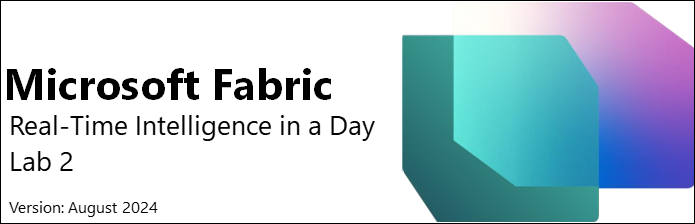

# Contents  

- Document Structure  
- Introduction  
- Fabric Eventstreams  
  - Task 1: Create an Eventstream
  - Task 2: Setup Eventstream Destination 
- Kusto Query Language (KQL)  
  - Task 3: Authoring Kusto Database Queries  
  - Task 4: Using T-SQL Queries Against a KQL Database
- KQL Queryset  
  - Task 5: Create a KQL Queryset 
  - Task 6: Visualize KQL Queryset
- References

## Document Structure

The lab includes steps for the user to follow along with associated screenshots that provide visual aid. In each screenshot, sections are highlighted with orange boxes to indicate the area(s) user should focus on.

## Introduction 

 In this lab, you will experience a way to handle a continuous stream of real-time data. You will use a Fabric Real-Time Intelligence object
 called an Eventstream to ingest this data to the Eventhouse you created in the last lab and write some basic KQL queries.

 By the end of this lab, you will have learned:

-   How to create an Eventstream

-   Load Real-time data into a KQL Database

-   Write basic Kusto Query Language Queries

##  Fabric Real-Time Hub

### Task 1: Create an Event Stream Source 

1.  Open the **Fabric workspace** you created in the last lab. From here we can see the Eventhouse we created.

    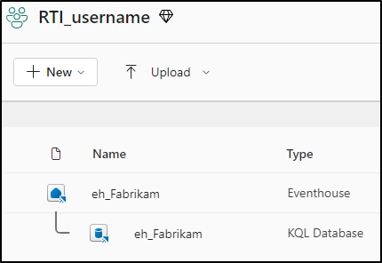

1.  Navigate to the "Real-Time hub" where currently we do not see any streams of data. That will change shortly.

    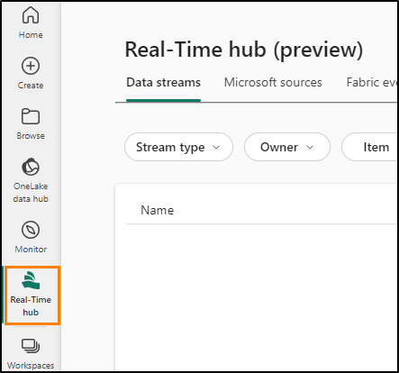

1.  Select the "Get events" green button which should be in the upper right corner.

    

1.  A window will open that will allow you to select a source for our stream data. As we discussed before, there are many fantastic options to choose from but for this class we will select the option "Azure Event Hubs".
    
    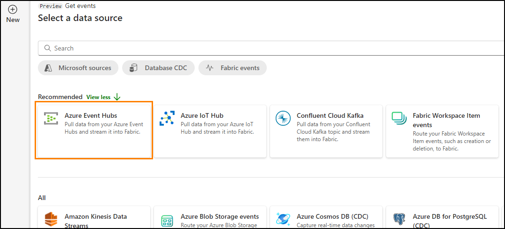

1.  You are now required to create a connection to the Azure Event Hub. Click on the **New connection** text since you do not currently have a connection.
    
    

1.  From your environment details page, copy and paste all the necessary connection settings into the appropriate fields. For these labs we are connecting to an Event Hub which has streaming data being sent from a python notebook. This notebook is creating fake sales transactions at rate of around 3,100 transactions per hour.
    
    - Event Hub namespace: **rtiadhub<inject key="DeploymentID" enableCopy="false"></inject>**
    
    - Event Hub: **rti-iad-fabrikam**
    
    - Shared Access Key Name: **rti-reader**
    
    - Shared Access Key: Copy the **Primary Key** value from the **event hub** page from Shared Access Policies.
  
    >**Note**:
    - To copy the primary key, follow these steps:
        - Go back to the Azure portal.
        - In the search bar, type "Event Hub" and select the Event Hub.
        - Under the "entities" section, choose **event hubs (1)**.
        - Select **rti-iad-fabrikam (2)**.
        - under settings , select **shared access policy**
        - Copy the **Primary Key (3)** from rti-reader.

1.  Once all properties have been filled out click on **Connect**.
    
    

1.  In the configuration of the Azure Event Hub data source, you will need to modify the **Consumer group** of the Event Hub to ensure that you gain access to a unique access point to the stream of data. Within your **Environment details** find the property that lists what your consumer group name will be and place that into the field box. It will appear something like "**$Default**".
    
    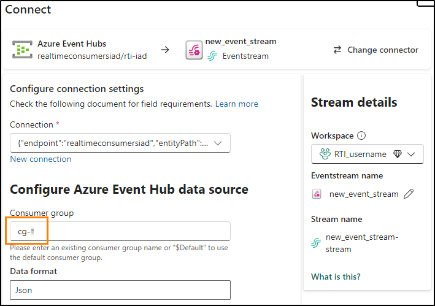

    >**Note**: Choose "**$Default**" as Consumer group

1.  Before we finalize this data source and Eventstream, let's go ahead and rename our Eventstream to something more useful. In the "Stream details\" section on the right select the pencil icon next to the "Eventstream name" and let's call our Eventstream "**es_Fabrikam_InternetSales**".

    

1. Now we can click on **Next**, which will take us to a final overview page.
    
    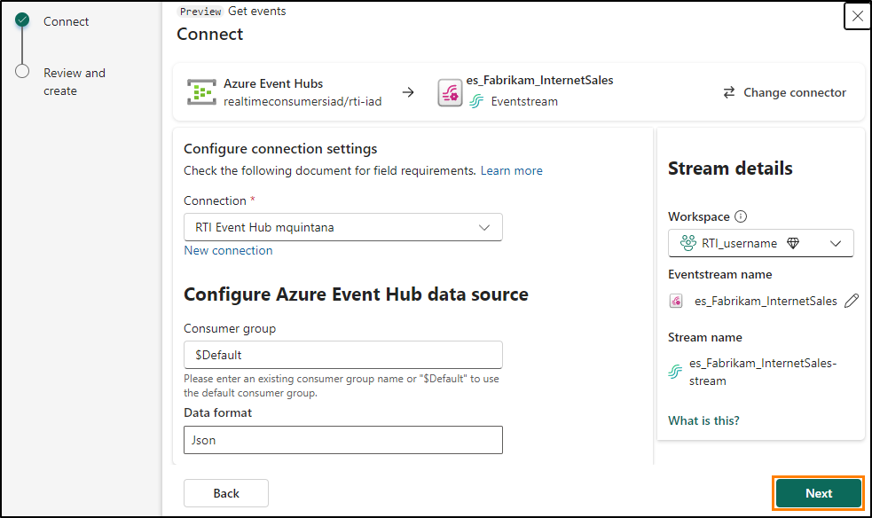

    >**Note**: The Event Source connection stream may fail with a session timeout error, but you should still see the Event Source listed as created once you refresh .

1. In this overview screen, Verify the contents look correct and click **Create source**.
    
    

1. Once the Eventstream and Eventstream source are created select the option "**Open Eventstream**"
    
    

1. This will take you to the Eventstream user interface. Here is where you will see able to connect with a source stream of data, bring it
    into this Fabric item, and then stream it to a new destination like a Lakehouse or KQL Database.

1. It may take a few moments for your Source to be **Active** but after waiting a few moments, click on the middle icon with the name of
    your Eventstream on it and then click on **Refresh** if you do not see a preview of the data.
   
    >**Note: If you receive a "Warning" status around and audit policy, that is fine. The stream will still function**

    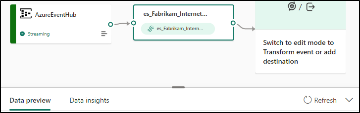

1. You should now see a sample of the data within the bottom window.
    
    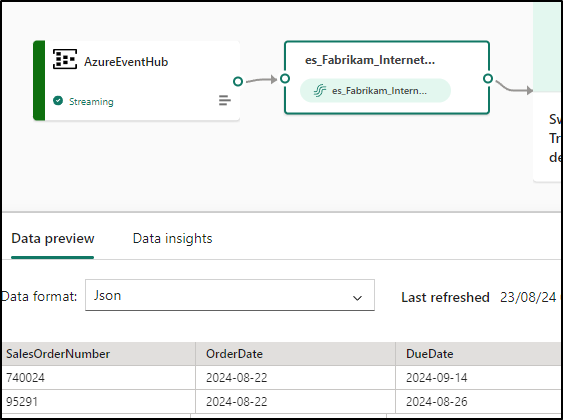

18. This will show you a preview of the data that is being received from the Azure Event Hub. If you slide your bottom horizontal scroll bar all the way to the right-side of your preview, you will be able to see the time that the data has been received in the Event Hub in twocolumns called, **EventProcessedUtcTime** and**EventEnqueuedUtcTime**. This should reflect the current date/time in UTC format.

    

### Task 2: Setup Eventstream Destination

1.  Click on the tile within the canvas area labeled "Switch to edit mode to Transform event of add destination
    
    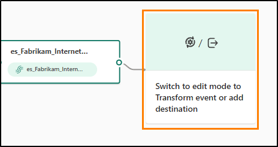

2.  Within the Eventstream user interface, click on the **Transform vents or add destination** option to open the drop-down menu.

    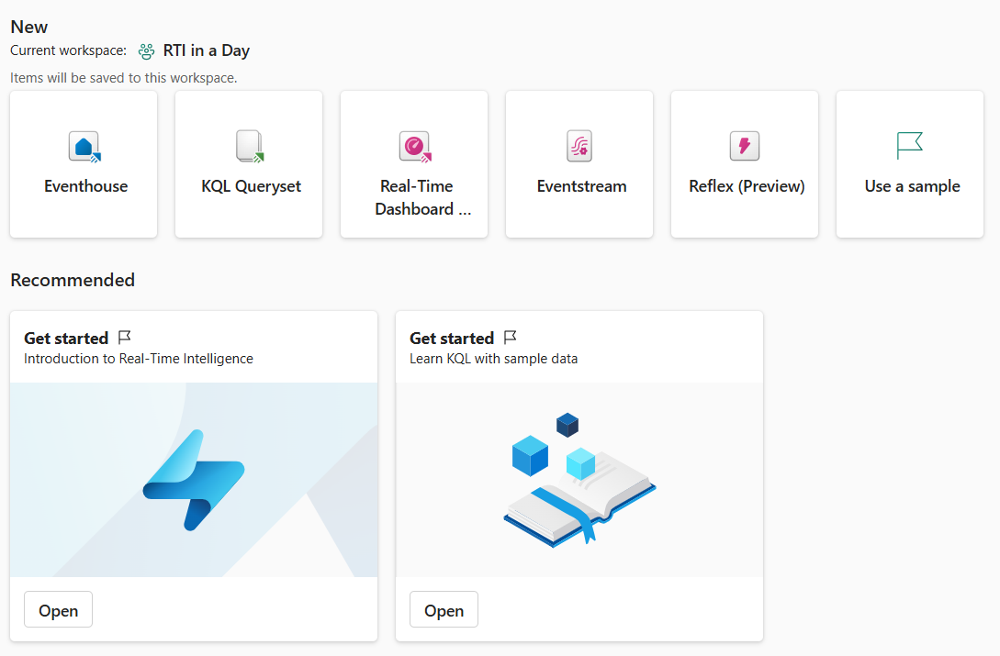

3.  View the list of available operations that can be made to the stream.

    

4.  Look below the operations and you will find the **Destinations** select the option that says **KQL Database**.

    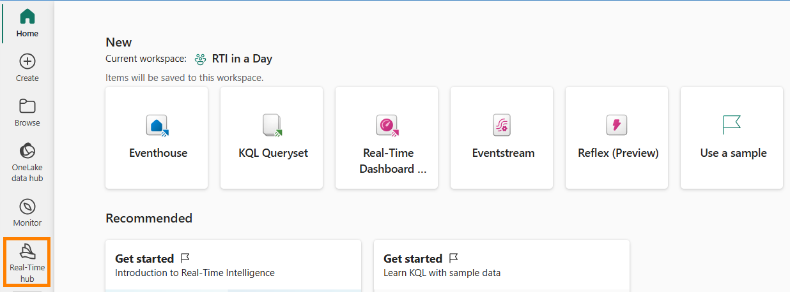

5.  A new menu will open on the right-hand side of the screen. The first thing you need to modify for the destination is the **data ingestion mode**. The two options are **Direct Ingestion** and **Event processing before ingestion.** Because we are not going to transform anything in our Eventstream and directly load this information in a KQL database table ensure that you have selected the **Direct Ingestion** option.

    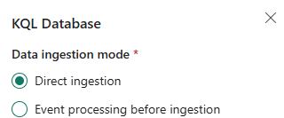

6.  Modify the remainder of the settings with the following details below.

    -   Destination name -- **eh-kql-db-Fabrikam**

    -   Workspace -- **RTI_<inject key="AzureAdUserEmail"></inject>**

    -   Eventhouse -- eh_Fabrikam

    -   KQL Database -- **eh_Fabrikam**

        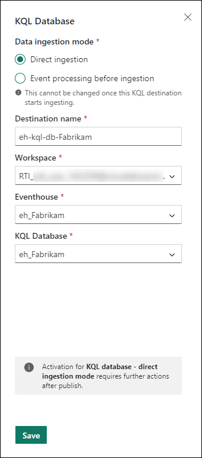

7.  Click on Save.

8.  With the Eventstream configured, click on the **Publish** button to save this Eventstream and begin your ingestion.

    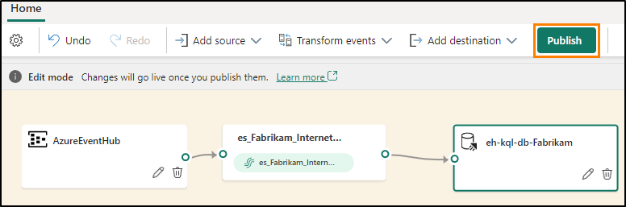

9.  Choose the **Configure** option within the **Destination** to  correctly map the stream to a table in the KQL Database.

    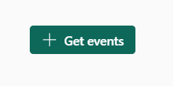

10. Click on the **+ New table** option underneath the **eh_Fabrikam** database.

    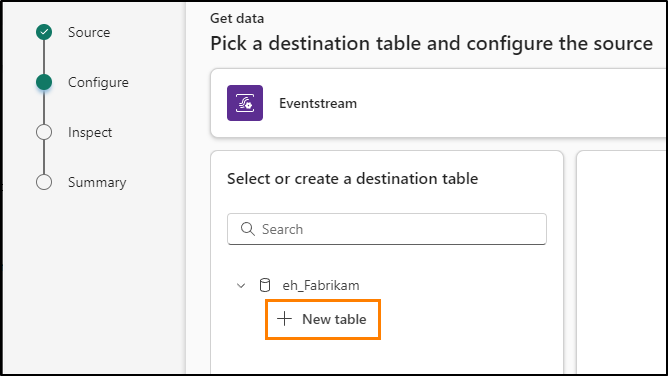

11. Give the new table the name, **InterentSales** and then click on the checkmark.

    

12. You may need to update your **"Data connection name"** to meet requirements. Let us rename it to **"eh_Fabrikam_es_InternetSales".** Then we can click on **Next**.
    
    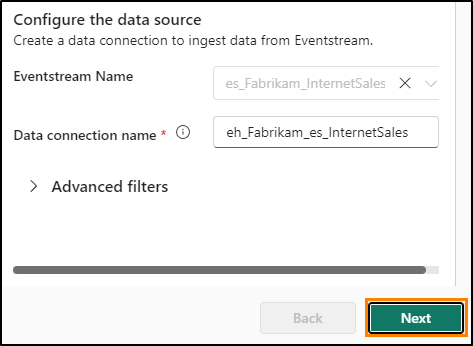

13. After a few moments of searching for events, the user interface should allow you to see that sample data was found. Click on **Finish** at the bottom of the screen.

    

14. After this you will be shown a summary. Once you have all green checkmarks, click **close** to move forward.

15. Once you see the user interface showing the mappings from the source to the Eventstream to the destination, you have correctly configured
    and started a stream of data into your KQL Database.

    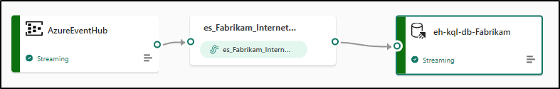

# Kusto Query Language (KQL)

## Task 3: Authoring Kusto Database Queries

1.  Make your way back to your **RTI_<inject key="AzureAdUserEmail"></inject>** workspace. You should see two new objects that have been created because of your
    Eventstream. The Eventstream itself as well as a Real-Time Intelligence Data stream.

    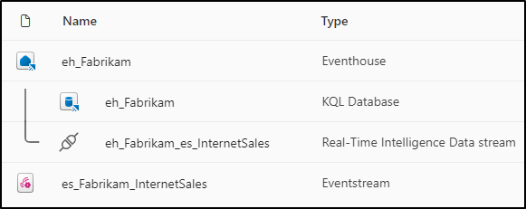

2.  Open the **eh_Fabrikam** KQL Database item.

    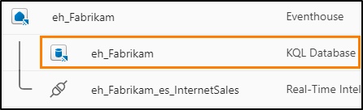

3.  Within this experience, you can get an overview of the current structure, size, and use of the KQL Database. Because the Eventstream is sending data to this KQL Database consistently you will notice the amount of storage will increase over time.

    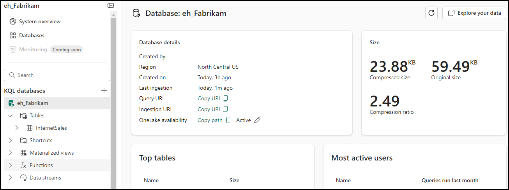

4.  Click on the **refresh icon** in the top-right corner of the screen.

    

5.  The size of the database should have grown. Your numbers here will not be exact in their reflection with screenshots in the remainder
    of the lab as depending on how long you take to complete the content you will have received less or more records than other members of
    the class. This is completely fine and will not affect your ability to follow along whatsoever.

    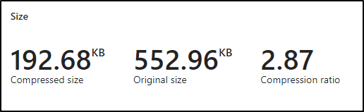

6.  Within your System details on the left-hand side of the screen, click on the table within your KQL Database called **InternetSales**.

    

7.  This menu will give you metadata details about the table you have created and any actively streaming data with your Eventstream.
    Again, the size of the table and the number of rows within the table are going to vary from student to student and will not affect your
    end results of this or any lab. A few additional items to call out on this menu include:

    -   **Schema** -- This includes details about the column name and the data types of the column that can be queried with KQL.

    -   **Mappings** -- This will list all the sources of data and in what format the data is being received. You can have various sources in
    various formats all mapping data to the same table on a KQL  Database.

    -   **OneLake availability** -- This is currently active because of the  property we enabled at the higher level in the Eventhouse.

        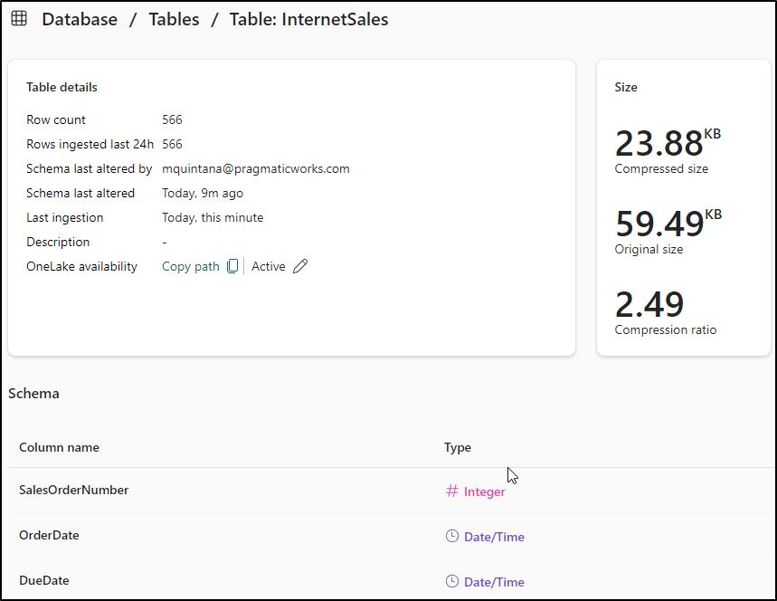

8.  Click on **Explore your data** in the top-right corner.

    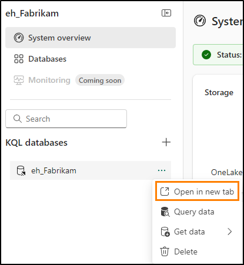

9.  This will open an interface in which you can author KQL queries against your database tables. There are a few pre-scripted queries
    that are already authored but need some slight customization. There are also two links to Microsoft documentation that can be helpful
    when learning KQL or also looking at SQL to KQL conversions which will be discussed later throughout this class.

    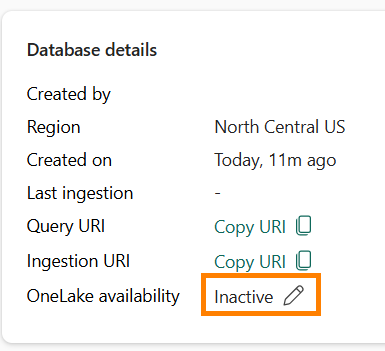

10. Click on **Line 8** and where the query says, **YOUR_TABLE_HERE**, replace that with the table name, **InternetSales**.

    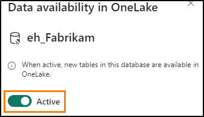

11. Highlight **Line 8 and 9** and click on the **Run** button in the top-left corner of the window.

    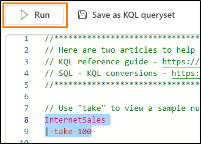

12. The query uses the **take** operator to bring back a specified number of rows. When the query runs it will pull data from the InternetSales table and bring back whatever number of rows you have plugged into the query. For this example, 100 rows will return. The specific rows returned cannot be determined with this operator and the results of your query will vary from the result of others.

    

13. Click on **Line 12** and where the query says, **YOUR_TABLE_HERE**, replace that with the table name, **InternetSales**.

    

14. Highlight **Line 12 and 13** and click on the **Run** button in the top-left corner of the window.
   
    

15. This query uses the count operator. This query will return an aggregated number of records that exist at the time of the query execution on the KQL Database table. Feel free to run this query a few more times and you should notice that the number of records increases after every few seconds.

    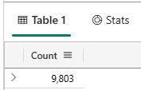

16. Repeat the previous steps for the final query that is automatically created for you on **Line 16** and run the query again.

    

17. This query will give you the number of records that have been ingested into your table within an hour window. The overall distribution of these records for the data you are currently ingesting will be approximately 4,100 per hour. There will be slight variations within that numbers of transactions per hour though and this query will detail if less or more records were ingested in each
window.

### Task 4: Using T-SQL Queries Against a KQL Database

You may be working with the Kusto Query Language for the first time.While this language is intuitive and easy to learn for simple queries, you may want to return the results of a more complex queries than you are currently capable of. Several helpful tools have been included within the KQL Queryset capabilities including converting SQL queries to KQL queries and simply authoring T-SQL queries within the KQL Queryset. Let's explore!

1.  You need to create a query that returns the number of each product that has been sold. This is something you can quickly do with T-SQL.Within the query window, you can translate your SQL queries into KQL to better understand how to author KQL queries in the future. Start with writing the following command.
    
    ```
        --
    explain
    ```
    
        
    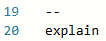

1. The comment line "--" followed by the keyword "explain" will allow you to now create a SQL query and return a result with the KQL query that could be used to achieve a similar query and result. Below input the following query to explain what the KQL query would look like:

   ```
       --
    explain
    SELECT COUNT(OrderQuantity) AS CountOfProducts
            , ProductKey
    FROM InternetSales
    GROUP BY ProductKey
    
    ```
    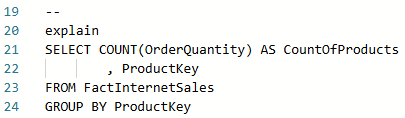


3. This is a simple SQL query that will retrieve results from the InternetSales table to return two columns, the product key and a count of the number of orders. Because there is an aggregated column and a non-aggregated column, you must use a GROUP BY to return results for each individual product. Run the entire query beginning with the "--" to the end of the T-SQL query.

   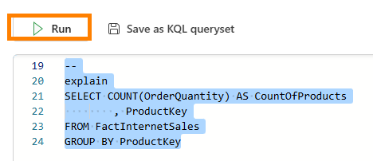

4. The output of the explain query should be a single record with the translated KQL query as the result. Click on the **caret icon (>)** to expand the results and allow for easier translation.

   

5. Click on the query pane highlighted below in orange. This will allow you to select translated KQL query and copy it. Paste this query in
   the KQL Queryset we have been using

   

6. With the results in your query pane, highlight and run the query to retrieve the results. The **summarize** operator will produce a  table that aggregates the content of the input table while determining how to group each record with the **by Product Key** and the **project** operator will select the columns to include, rename, or drop while inserting new compute columns.

    

7. Feel free to explore a complete list of SQL to KQL cheat sheet operations at the top of your queryset for additional capabilities and conversions.

    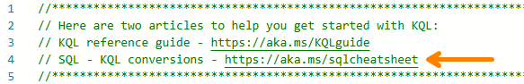

8. Instead of using KQL, another alternative to querying the results of the KQL Database within Fabric is to write and run a T-SQL query.
    Highlight the original SQL statement that was used to translate the kQL query and run only that.

    

9. This will also yield perfectly valid results without having to convert to KQL beforehand.

    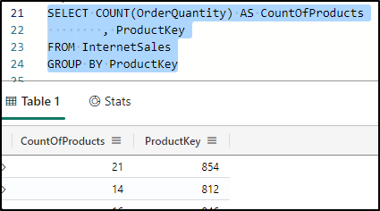

# KQL Queryset

## Task 5: Create a KQL Queryset

1.  While most of the queries within this window were automatically created from the user interface, there may be times in the future where you wish to save the results of a query to access later in your exploration of KQL and working with your real-time data. Within the **Explore your data** window, you have several additional options for how to accomplish something like this.

2.  Click on the option **Save as KQL queryset**.

    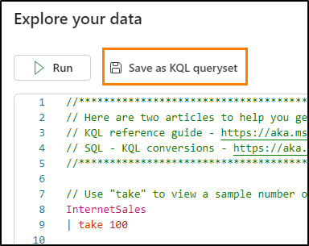

3.  Within the window that appears input the name of the object you're creating as **First KQL Query**. Click on **Create**.

    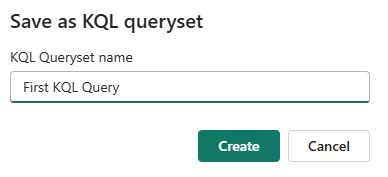

4.  A OneLake data hub menu may appear allowing you to connect to other KQL databases available in your organization. If this does appear, select the "**Cancel"** option in the bottom right corner

5.  You will see a new user interface appear when the KQL queryset opens. A new object has been created within your workspace that allows you to quickly go back to this queryset that you have authored and continue to add more queries, pin results to a dashboard, or build a Power BI report. Additional capabilities
within this interface include working with Copilot, should that be available to your organization, and exporting results to a CSV file.

    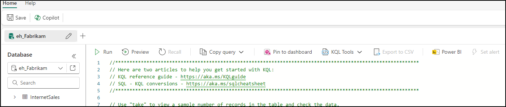

6.  Return to your **RTI_<inject key="AzureAdUserEmail"></inject>** workspace. You should have the following objects present

    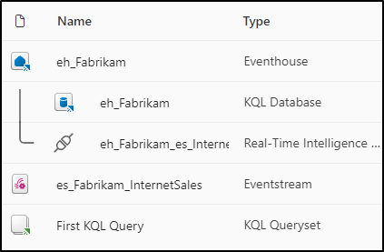

## Task 6: Visualize KQL Queryset

### Task 6.1: Create a Real-Time Dashboard

1. Open the **Fabric workspace** for the course.

   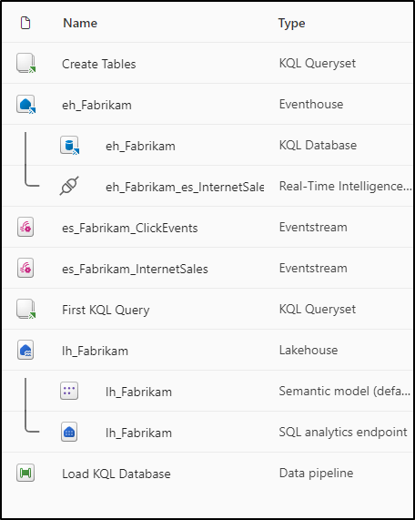

2. Click on the **+ New** drop-down menu to create a new item.

   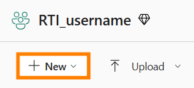
3. The item you are looking for isn't on this list, so go to the option at the bottom of the list called **More options** and click on it.

   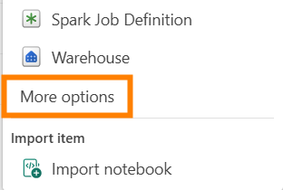

4. Scroll to the bottom of the page and you will see a category for **Real-Time Intelligence**. Click on the item called **Real-Time Dashboard**.

   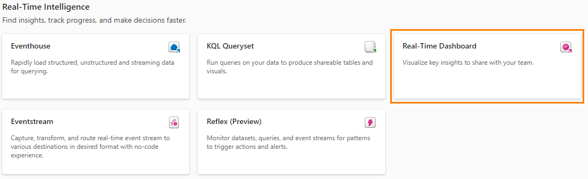

5. Give your Real-Time Dashboard the name **RTI Dashboard** and then click on **Create**.

   

6. You should be immediately taken to a blank instance of a Real-Time Dashboard.

   

### Task 6.2: Connect a Data Source to Real-Time Dashboard

1. Under the Home ribbon find the option called **New data source** and click it.

   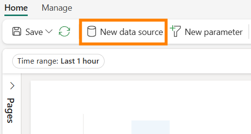

2. In the flyout pane that appears on the right-hand side of the screen, click on **Add +** and then choose **OneLake data hub**.

   
3. A list of available sources in your OneLake will appear, only sources from KQL Databases will be listed so one option will be available for you, the **eh_Fabrikam** KQL Database. Select that option.

   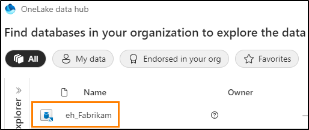

4. At the bottom of the screen click **Connect**.

   

5. You will now be able to create the data source. Click on the **Add** button at the bottom of the flyout pane.

   

6. You will now see that one data source has been added to the Real-Time Dashboard. From here you could add additional KQL Databases should the need arise. For now, click on **Close** at the bottom of the window.

   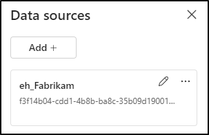

### Task 6.3: Create a Real-Time Dashboard Tile with KQL

1. Click on the blank tile within the dashboard to populate the tile with a visual.

   
   
3. By default you will connect to the KQL Database you created earlier as your source. From here you can write out your own KQL query to populate this visual with data. Delete all previous markdown KQL that is there by default. Copy and paste the following query into the query window.

   ```
   //Clicks by hour
   InternetSales
   | where OrderDate between (_startTime.._endTime)
   | summarize date_count = count() by bin(OrderDate, 1h) 
   | render timechart  
   | top 30 by date_count

    ```

4. Run the query once you have it configured correctly to see the results.

   

5. Notice that you may only have one result in your output. This is because of the **Time range** that is set by default for this tile. You have a parameter with which you can alter the range of time with which you are returning data from. The eventDate between (\_startTime..\_endTime) is what allows you to take advantage of this parameter. Modify the **Time Range** parameter to **Last 1095 days** and observe how your output changes.

   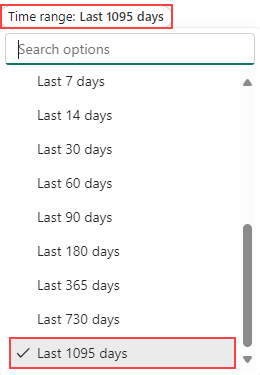

6. You should now see in your query output the results of clicks over the last 3 hour window.

   

7. While this parameter can be modified, you may wish for it to default to a specific time range instead of forcing users to modify it. Above the time range option, click on the **@ Parameters** option.

   

8. Click the **pencil icon** to edit the **Time range** parameter.

   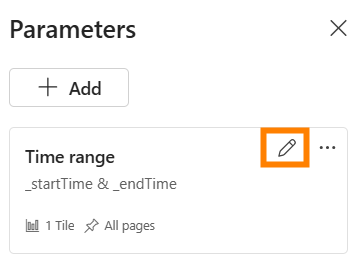

9. Change the **Default value** to **Last 24 hours** to always show the last day by default. Click **Done** when finished.

   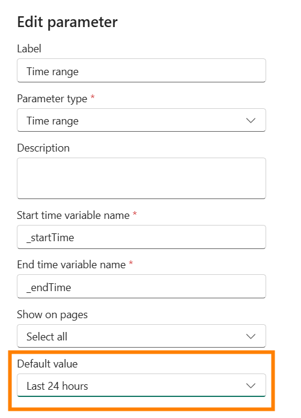

10. Close the parameter pane.

11. Now click on the **+ Add visual button** above the query results.

    

12. A new flyout will appear on the right-hand side of the screen. Click in the text box underneath the **Tile name** option to give this visual the name **Clicks by Hour**.

    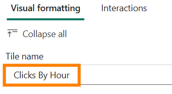

13. By default, the visual that you're using to display the results of this KQL query is a table. This may not be the best way for someone to quickly consume and comprehend what is happening with the results of your data. Change the type of visual from a table to an **Area chart**.

    

14. With this newly formatted visual, you can better understand the peaks and valleys of Clicks from your e-commerce site using the data stream you created earlier in this class.

    

15. To save this visual down to the Dashboard, click on the **Apply changes** button in the top-right corner of the screen.

    

16. Once this visual has been placed within the Dashboard, notice again that the visual is only showing the last hour of results. Modify the Dashboard to show the **Time Range** of the **Last 24 hours**.

    

17. Refresh the visual and notice that the results will slightly change to reflect the data that has come in since the last execution of the query.

    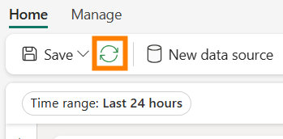

### Task 6.4: Add More Dashboard Tiles to Real-Time Dashboard

1. From the **Home ribbon** in the Real-Time Dashboard click on the **New tile** button.

   

2. Enter the following KQL query into the query pane.

   ```
   //Impressions by hour
   Impressions
   | where eventDate between (_startTime.._endTime)
   | summarize date_count = count() by bin(eventDate, 1h) 
   | render timechart  
   | top 30 by date_count
   
   ```
3. **Run** the query.

   

4. Click the **+ Add** visual button.

   

5. Edit the visual to change the **Tile name** to **Impressions by Hour** and the **Visual Type** to **Area chart**.

   

6. Apply changes to the visual.

   

7. Add another **+ New tile**.

   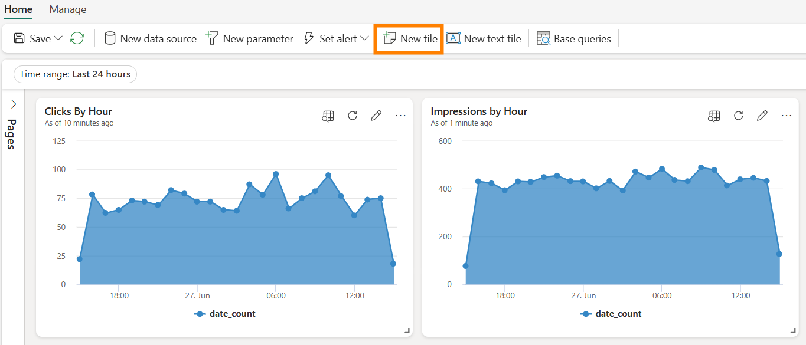

8. Copy and paste the following query into the query pane. Note, this is a multi-statement query that uses multiple let statements & a query combined by semicolons.

   ```
   //Clicks, Impressions, CTR
   
   let imp =  Impressions
   | where eventDate  between (_startTime.._endTime)
   | extend dateOnly = substring(todatetime(eventDate).tostring(), 0, 10) 
   | summarize imp_count = count() by dateOnly; 
   
   let clck = Clicks
   | where eventDate  between (_startTime.._endTime)
   | extend dateOnly = substring(todatetime(eventDate).tostring(), 0, 10) 
   | summarize clck_count = count() by dateOnly;
   
   imp  
   | join clck on $left.dateOnly == $right.dateOnly 
   | project selected_date = dateOnly , impressions = imp_count , clicks = clck_count, CTR = clck_count * 100 / imp_count
   
   ```

9. **Run** the query to view the results.

   

10. Click the **+ Add visual** button.

11. When the visual settings appear modify the following settings to create a count of Impressions.

    - **Tile name** - Impressions
    - **Visual type** - Stat
    - **Value column** - impressions (long)

    

12. Choose **Apply changes** when all settings are configured appropriately.

    

13. On the new tile, click on the ellipses (...) and select the option to **Duplicate tile**.

    

14. Click on the **pencil icon** for the duplicated tile to edit the configurations.

    

15. Rename this **Tile name** to **Clicks** and change the **Value column** to **clicks (long)**.

    

16. Apply the changes to this visual.

17. Duplicate either one of the new tiles one more time to create one final stat visual.

    

18. Edit the new tile to change the **Tile name** to **Click Through Rate** and the **Value column** to **CTR (long)**.

    
19. Apply the changes.

20. If the tiles are separated or you wish to reorganize them, you can hover over the tile until a hand icon appears and drag and drop the visual where you wish.

    

## Summary

In this lab, you began by setting up a connection to an Event Hub that has a running stream of data and used an Eventstream to take that data and ingest it into a KQL Database. Once the data was ingested, you were able to author several KQL queries and look at the functionality of using T-SQL to help learn KQL syntax or simply return results with SQL statements.

## References 

Fabric Real-time Intelligence in a Day (RTIIAD) introduces you to some of the key functions available in Microsoft Fabric.

In the menu of the service, the Help (?) section has links to some great resources.


Here are a few more resources that will help you with your next steps with Microsoft Fabric.

-   See blog post to read the full [Microsoft Fabric GA announcement](https://aka.ms/Fabric-Hero-Blog-Ignite23)
-   Explore Fabric through the [Guided  Tour](https://aka.ms/Fabric-GuidedTour)
-   Sign up for the [Microsoft Fabric free trial](https://aka.ms/try-fabric)
-   Visit the [Microsoft Fabric  website](https://aka.ms/microsoft-fabric)
-   Learn new skills by exploring the [Fabric Learning  modules](https://aka.ms/learn-fabric)
-   Explore the [Fabric technical  documentation](https://aka.ms/fabric-docs)
-   Read the [free e-book on getting started with  fabric](https://aka.ms/fabric-get-started-ebook)
-   Join the [Fabric community](https://aka.ms/fabric-community) to post  your questions, share your feedback, and learn from others

Read the more in-depth Fabric experience announcement blogs:

-   [Data Factory experience in Fabric blog](https://aka.ms/Fabric-Data-Factory-Blog)
-   [Synapse Data Engineering experience in Fabric  blog](https://aka.ms/Fabric-DE-Blog)
-   [Synapse Data Science experience in Fabric  blog](https://aka.ms/Fabric-DS-Blog)
-   [Synapse Data Warehousing experience in Fabric  blog](https://aka.ms/Fabric-DW-Blog)
-   [Real-](https://aka.ms/Fabric-RTA-Blog)[Time Intelligence  experience in Fabric blog](https://blog.fabric.microsoft.com/en-us/blog/category/real-time-intelligence)]
-   [Power BI announcement  blog](https://aka.ms/Fabric-PBI-Blog)
-   [Data Activator experience in Fabric  blog](https://aka.ms/Fabric-DA-Blog)
-   [Administration and governance in Fabric  blog](https://aka.ms/Fabric-Admin-Gov-Blog)
-   [OneLake in Fabric  blog](https://aka.ms/Fabric-OneLake-Blog)
-   [Dataverse and Microsoft Fabric integration  blog](https://aka.ms/Dataverse-Fabric-Blog)


 © 2024 Microsoft Corporation. All rights reserved.

 By using this demo/lab, you agree to the following terms:

 The technology/functionality described in this demo/lab is provided by Microsoft Corporation for purposes of obtaining your feedback and to
 provide you with a learning experience. You may only use the demo/lab to evaluate such technology features and functionality and provide
 feedback to Microsoft. You may not use it for any other purpose. You may not modify, copy, distribute, transmit, display, perform,
 reproduce, publish, license, create derivative works from, transfer, or sell this demo/lab or any portion thereof.

 COPYING OR REPRODUCTION OF THE DEMO/LAB (OR ANY PORTION OF IT) TO ANY OTHER SERVER OR LOCATION FOR FURTHER REPRODUCTION OR REDISTRIBUTION IS EXPRESSLY PROHIBITED.

 THIS DEMO/LAB PROVIDES CERTAIN SOFTWARE TECHNOLOGY/PRODUCT FEATURES AND FUNCTIONALITY, INCLUDING POTENTIAL NEW FEATURES AND CONCEPTS, IN A
 SIMULATED ENVIRONMENT WITHOUT COMPLEX SET-UP OR INSTALLATION FOR THE PURPOSE DESCRIBED ABOVE. THE TECHNOLOGY/CONCEPTS REPRESENTED IN THIS DEMO/LAB MAY NOT
 REPRESENT FULL FEATURE FUNCTIONALITY AND MAY NOT WORK THE WAY A FINAL VERSION MAY WORK. WE ALSO MAY NOT RELEASE A FINAL VERSION OF SUCH FEATURES OR CONCEPTS. 
 YOUR EXPERIENCE WITH USING SUCH FEATURES AND FUNCITONALITY IN A PHYSICALENVIRONMENT MAY ALSO BE DIFFERENT.

 **FEEDBACK**. If you give feedback about the technology features,functionality and/or concepts described in this demo/lab to Microsoft,you give to Microsoft, 
 without charge, the right to use, share and commercialize your feedback in any way and for any purpose. You also give to third parties, without charge, any 
 patent rights needed for their products, technologies and services to use or interface with any specific parts of a Microsoft software or service that 
 includes the feedback. You will not give feedback that is subject to a license that requires Microsoft to license its software or documentation to third
 parties because we include your feedback in them. These rights survive this agreement.

 MICROSOFT CORPORATION HEREBY DISCLAIMS ALL WARRANTIES AND CONDITIONS WITH REGARD TO THE DEMO/LAB, INCLUDING ALL WARRANTIES AND CONDITIONS OF MERCHANTABILITY, 
 WHETHER EXPRESS, IMPLIED OR STATUTORY, FITNESS FOR A PARTICULAR PURPOSE, TITLE AND NON-INFRINGEMENT. MICROSOFT DOES NOT MAKE ANY ASSURANCES OR
 REPRESENTATIONS WITH REGARD TO THE ACCURACY OF THE RESULTS, OUTPUT THAT DERIVES FROM USE OF DEMO/ LAB, OR SUITABILITY OF THE INFORMATION
 CONTAINED IN THE DEMO/LAB FOR ANY PURPOSE.

 **DISCLAIMER**
 
 This demo/lab contains only a portion of new features and enhancements in Microsoft Power BI. Some of the features might change in future
 releases of the product. In this demo/lab, you will learn about some, but not all, new features.
